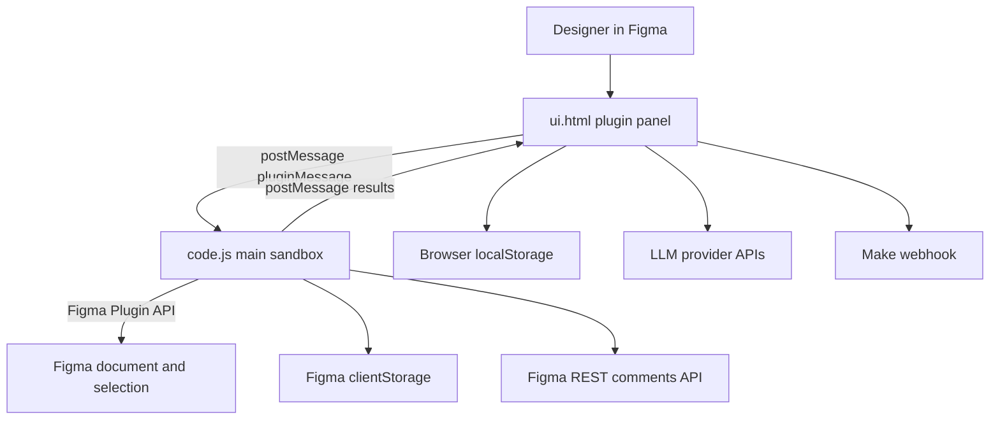
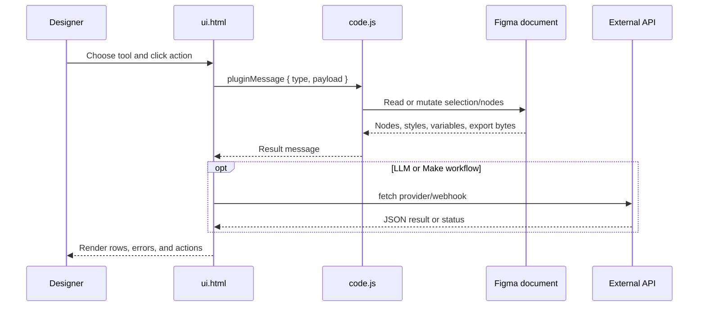

# OneManStudio Figma Plugin

Direct-load Figma plugin for inspecting and repairing design files: color/style cleanup, empty layer cleanup, frame renaming, detached component replacement, text extraction/editing, optional LLM copy helpers, hidden comment inspection, and Make webhook sync.

There is no build step in this repository. Figma loads `code.js` and `ui.html` directly from `manifest.json`.

## Quick start

1. Open Figma desktop or browser.
2. Go to **Plugins** -> **Development** -> **Import plugin from manifest...**.
3. Select this repository's `manifest.json`.
4. Run **OneManStudo — Swiss Army Knife for Independent Designers** from the development plugins menu.

### Repository layout

| File | Purpose |
| --- | --- |
| `manifest.json` | Plugin metadata, Figma entry points, editor type, network allowlist, `teamlibrary` permission. |
| `code.js` | Main plugin sandbox. Reads/writes Figma nodes, scans styles/variables, imports library components/variables, fetches Figma comments. |
| `ui.html` | Plugin UI, CSS, localStorage state, LLM provider calls, Make webhook calls, file import/export. |

## Architecture





## Runtime permissions and constraints

- `editorType` is `figma`; FigJam is not enabled.
- `documentAccess` is `dynamic-page`; most scans operate on the current page and current selection.
- Network allowlist currently includes:
  - `https://api.figma.com`
  - `https://openrouter.ai`
  - `https://hook.make.com`
  - `https://www.make.com`
  - `https://eu1.make.com`
  - `https://us1.make.com`
- `ui.html` also contains direct calls to:
  - `https://api.openai.com/v1/chat/completions`
  - `https://api.deepseek.com/chat/completions`
  - `https://api.anthropic.com/v1/messages`
- If native OpenAI, DeepSeek, or Anthropic requests fail inside Figma while OpenRouter works, update `manifest.json` to allow those domains or route through OpenRouter.
- Library colors/components require the `teamlibrary` permission already present in `manifest.json`.

## User-facing workflows

### Styler

Intent: find direct colors, saved paint styles, variable-bound fills, and text style usage so designers can apply shared styles consistently.

Entry points:

- **Styler -> Text -> Scan unlinked color styles** sends `scan`.
- **Styler -> Layers -> Scan fill colors** sends `scanLayers`.
- Style/variable dropdowns send `applyFillToGroup`.
- Text style dropdowns send `applyTextStyleToGroup`.

Constraints:

- Text scans require exactly one selected `FRAME` or `GROUP`.
- Layer scans require exactly one selected `FRAME` or `GROUP`.
- Text style application skips empty text nodes because there is no character range to style.
- Library variables may be imported by key before application.

### Cleaner

Intent: find likely removable clutter before deletion.

Flow:

1. Select exactly one `FRAME`.
2. Click **Find empty elements**.
3. Review rows and select items.
4. Click **Delete** to remove selected node ids.

The scanner reports empty frames/groups, hidden layers, opacity `0`, and layers with empty fill and stroke. Hidden items are collected internally but filtered out of the visible cleaner result.

### Frame Name

Intent: rename selected frames in a predictable sequence.

Flow:

1. Select one or more `FRAME` nodes.
2. Enter a prefix containing only `a-z` or `A-Z`.
3. Optionally enable reverse layer panel order.
4. Click **Rename frames**.

Output names use `Prefix-01`, `Prefix-02`, etc. Without layer panel order, frames are sorted visually top-to-bottom, then left-to-right.

Settings stored in Figma `clientStorage`:

- `rewriterPrefix`
- `rewriterLayerPanelOrder`

### Detach seek

Intent: find detached instances and replace them with matching library components.

Main actions:

- **Find detached** sends `findDetached` for one selected `FRAME` or `SECTION`.
- **Parse components** sends `parseComponents` to compare local components with available library components.
- **Change detached** sends `replaceDetached` with `{ nodeId, componentKey }` rows.
- **Replace with library** sends `replaceLocalWithLibrary` with `{ componentId, componentKey }` rows.

Replacement preserves position, size, rotation, visibility, opacity, name, layout sizing, and text contents when possible.

### Comments

The comments panel exists in the DOM but its sidebar menu item is hidden with CSS. If exposed, it:

1. Accepts a Figma personal access token.
2. Verifies the token with `GET https://api.figma.com/v1/me`.
3. Fetches `GET https://api.figma.com/v1/files/{fileKey}/comments`.
4. Filters comments to nodes on the current page.

Required token scope: `file_comments:read`.

### Text

Intent: extract text layers from a selected frame, edit copy, exchange files, and optionally use LLM/Make helpers.

Manual flow:

1. Select exactly one `FRAME`.
2. Click **Extract text values**.
3. Edit rows in the plugin UI.
4. Click **Apply changes**.

Generated row shape:

```json
{
  "id": "12:34",
  "key": "Frame name_key-1",
  "value": "Visible text",
  "layerName": "Optional Figma layer name"
}
```

Text export/import:

- CSV export headers: `id,key,value`.
- JSON export shape: `{ "frameId": "...", "items": [...] }`.
- Import accepts a JSON array, a JSON object with `items`, or CSV with `value` plus either `id` or `key`.
- Imported values update the plugin inputs first; designers must click **Apply changes** to write to Figma nodes.

## LLM text helpers

LLM mode lives inside the Text panel. It can:

- Generate semantic resource keys from the selected frame screenshot and extracted text rows.
- Regenerate all extracted copy.
- Regenerate one row via that row's **LLM** button.

Provider profiles are stored per provider in `localStorage`:

- `openRouterProfilesByProviderV1`
- `openRouterProviderV1`
- Legacy fallback keys: `openRouterApiKeyV1`, `openRouterModelV1`, `openAiApiKeyV1`, `openAiModelV1`

Default models:

| Provider | Default model |
| --- | --- |
| OpenRouter | `openai/gpt-4o-mini` |
| OpenAI | `gpt-4o-mini` |
| DeepSeek | `deepseek-chat` |
| Claude | `claude-3-5-sonnet-20241022` |

Provider request contracts:

- OpenRouter/OpenAI/DeepSeek use chat completions with image content and `response_format: { type: "json_schema" }`.
- Claude uses Anthropic Messages with a base64 image source and a text instruction to return JSON only.
- Semantic key responses must contain `mappings[]` with `sourceId`, `suggestedKey`, and `reason`.
- Copy regeneration responses must contain `rows[]` with `sourceId`, `suggestedText`, and `reason`.

Semantic key constraints enforced by the UI:

- Keys are normalized to lower snake case.
- Non-ASCII and punctuation are replaced.
- Keys starting with a digit get a `k_` prefix.
- Duplicate keys receive numeric suffixes.

## Make webhook integration

The Make setup view and handlers are present, but the visible **Connect Make** button is not currently rendered in the Text toolbar. Sync works only when a saved scenario already exists in `localStorage`.

Scenario storage:

- `makeScenariosV1`
- `makeActiveScenarioIdV1`
- `figmaPluginUserIdV1`

Scenario fields:

```json
{
  "id": "scenario-...",
  "isDefault": true,
  "name": "Marketing EN",
  "webhookUrl": "https://hook.make.com/...",
  "scenarioKey": "marketing-copy",
  "targetSheetId": "1AbCdEf...",
  "targetSheetTab": "Sheet1",
  "secret": "optional"
}
```

Webhook payload for **Sync current text to Make**:

```json
{
  "event": "text_sync",
  "scenario_key": "marketing-copy",
  "target_sheet_id": "1AbCdEf...",
  "target_sheet_tab": "Sheet1",
  "plugin_user_id": "user-...",
  "frame_id": "12:34",
  "sent_at": "2026-07-06T16:02:02.361Z",
  "items": [
    {
      "id": "12:35",
      "key": "hero_block_title",
      "value": "Design faster",
      "layerName": "Title"
    }
  ]
}
```

Webhook payload for **Test connection**:

```json
{
  "event": "connection_test",
  "scenario_key": "marketing-copy",
  "target_sheet_id": "1AbCdEf...",
  "target_sheet_tab": "Sheet1",
  "plugin_user_id": "user-...",
  "sent_at": "2026-07-06T16:02:02.361Z",
  "items": []
}
```

Important constraints:

- Webhook URLs must use HTTPS.
- `scenario_key` and `target_sheet_id` are required.
- The optional `secret` is stored with the scenario but is not sent in headers or payload.
- Make status text is currently hidden/cleared by CSS and setter functions.

## UI-to-main message contract

Messages sent from `ui.html` to `code.js`:

| Type | Payload | Result type |
| --- | --- | --- |
| `resize` | `{ width, height }` | none |
| `load` | none | `documentStyles` |
| `scan` | none | `scanResult` |
| `scanLayers` | none | `scanLayersResult` |
| `getStylesAndVariables` | none | `stylesAndVariablesResult` |
| `applyFillToGroup` | `{ nodeIds, styleId?, variableId?, variableKey? }` | `applyFillToGroupResult` |
| `applyTextStyleToGroup` | `{ nodeIds, textStyleId }` | `applyTextStyleToGroupResult` |
| `findEmptyElements` | none | `cleanerResult` |
| `deleteNodes` | `{ ids }` | `cleanerDeleted` |
| `findDetached` | none | `detachResult` |
| `parseComponents` | none | `parseComponentsResult` |
| `replaceDetached` | `{ replacements: [{ nodeId, componentKey }] }` | `replaceDetachedResult`, `replaceDetachDebug` |
| `replaceLocalWithLibrary` | `{ replacements: [{ componentId, componentKey }] }` | `replaceLocalWithLibraryResult` |
| `grabComments` | `{ token, fileKey? }` | `commentsResult` |
| `selectNode` | `{ id }` | none |
| `selectNodes` | `{ ids }` | none |
| `extractTextKeyValues` | none | `textKeyValuesResult` |
| `captureFrameImageForLlm` | `{ frameId }` | `frameImageForLlmResult` |
| `updateTextKeyValues` | `{ frameId, updates: [{ id, value }] }` | `textKeyValuesUpdated` |
| `getSelectionFramesCount` | none | `selectionFramesCount` |
| `getRewriterSettings` | none | `rewriterSettings` |
| `saveRewriterLayerPanelOrder` | `{ value }` | none |
| `saveRewriterPrefix` | `{ prefix }` | none |
| `renameFrames` | `{ prefix, layerPanelOrder }` | `renameFramesResult` |

## Troubleshooting

### Plugin does not load

- Re-import `manifest.json` from Figma development plugins.
- Ensure `code.js` and `ui.html` are in the same directory as `manifest.json`.
- Check that edited files are valid JavaScript/HTML because there is no bundler safety net.

### Scan buttons show selection errors

- Styler scans require one selected `FRAME` or `GROUP`.
- Cleaner requires one selected `FRAME`.
- Detach seek requires one selected `FRAME` or `SECTION`.
- Text extraction requires one selected `FRAME`.

### Library variables or components are missing

- Confirm the library is enabled for the file/team.
- Confirm `teamlibrary` remains in `manifest.json`.
- Reload the plugin after manifest permission changes.

### LLM provider fails

- Save an API key and model for the active provider.
- For OpenRouter, use catalog slugs such as `openai/gpt-4o-mini`.
- For native providers, use native model ids such as `gpt-4o-mini`, `deepseek-chat`, or `claude-3-5-sonnet-20241022`.
- If native providers fail before reaching the API, check the manifest network allowlist.

### Make sync button stays disabled

- Extract text values first.
- Ensure a scenario exists in `makeScenariosV1` and `makeActiveScenarioIdV1`.
- The setup screen exists in code, but the Connect Make toolbar button is not currently rendered.

## Development notes

- Keep changes dependency-free unless a build pipeline is intentionally introduced.
- Prefer updating `code.js`, `ui.html`, and this README together when adding a new plugin message or external API.
- Document any new `localStorage`, `clientStorage`, network domain, or webhook payload field in this file.
