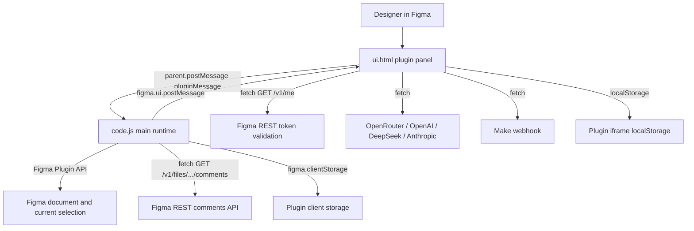
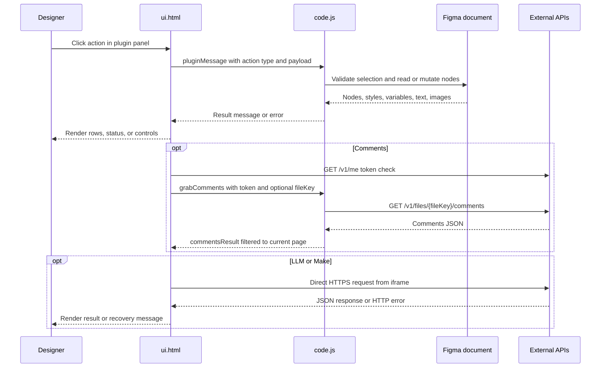

# OneManStudio Figma Plugin

Direct-load Figma plugin for independent designers. It combines style auditing,
cleanup, frame renaming, detached-component replacement, comment lookup, and
text/LLM copy workflows in one panel.

There is no build step. Figma loads `code.js` as the main sandbox runtime and
`ui.html` as the embedded UI.

Manifest display name (typo included): **OneManStudo — Swiss Army Knife for Independent Designers**.

Published plugin id: `1617619722767673308`. `editorType` is `["figma"]` only
(not FigJam or Slides).

## Run locally

1. In Figma, open **Plugins** → **Development** → **Import plugin from manifest…**.
2. Select this folder, or the `manifest.json` file inside it.
3. Run the plugin from **Plugins** → **Development**.

If Figma shows stale UI, permissions, or network errors after a manifest change,
remove the development plugin and re-import it. Network allowlist and
`teamlibrary` changes are picked up only after reload.

### Window sizes

| Mode | Size | Source |
| --- | --- | --- |
| Initial `figma.showUI` | `760 × 640` | `code.js` `PLUGIN_SIZE` |
| UI restore / expand | `759 × 640` | `ui.html` `PLUGIN_W` / `PLUGIN_H` |
| Minimize | `230 × 48` | `#menuMinimize` → `resize` |
| UI drag resize clamp | min `230 × 48`, max `1200 × 900` | `#resizeHandle` in `ui.html` |
| Main hard-cap | max `4000 × 4000` | `code.js` `resize` handler |

`PLUGIN_SIZE_MIN` in `code.js` (`200 × 48`) is unused. The UI always sends
`230 × 48` on minimize. The minimized chrome title is hardcoded to **Styler**,
even if another panel was active.

Light/dark theme is applied from `pluginUiThemeV1` in a head script before first
paint. The bottom-bar switcher writes the same key.

## Repository layout

| File | Purpose |
| --- | --- |
| `manifest.json` | Plugin id, entry points, `teamlibrary`, `documentAccess: "dynamic-page"`, network allowlist. |
| `code.js` | Main Figma sandbox. Reads/writes canvas nodes, imports library resources, stores Frame Name prefs in `figma.clientStorage`, fetches comments, posts results to the UI. |
| `ui.html` | Single-file plugin UI, theme, import/export, Make webhooks, LLM provider calls, Figma token validation. |

## Runtime architecture





`documentAccess` is `dynamic-page`. Current-page handlers do not load the rest
of the file. Detach seek / Parse components / local→library replace call
`figma.loadAllPagesAsync()` before scanning instances across pages.

Styler’s document-wide paint-style merge (`collectUsedPaintStyleIdsFromDocument`)
walks `figma.root.children` **without** `loadAllPagesAsync`. With dynamic-page
access, that walk only sees currently loaded pages, so unused-page library
colors may be missing until those pages are opened or another path loads them.

On UI boot the panel requests `getStylesAndVariables` once
(`stylesAndVariablesRequested` blocks a second fetch). That path **imports
every team-library COLOR variable** via `importVariableByKeyAsync` so pickers
can show hex swatches. Opening Styler in a file with a large library therefore
mutates the document’s variable set even if the designer never applies a color.

## Visible panels

Sidebar `data-panel` ids (Comments is CSS-hidden). Navigation is a bottom bar
(`#expandedView .sidebar` `order: 2`).

| `data-panel` | Panel | Default visibility |
| --- | --- | --- |
| `0` | Styler (Text / Layers tabs) | Visible |
| `5` | Text (manual / LLM / Make) | Visible |
| `1` | Cleaner | Visible |
| `2` | Frame Name | Visible |
| `3` | Detach seek | Visible |
| `4` | Comments | Hidden (`.menu-item[data-panel="4"]`) |

## Plugin capabilities

### Styler

Use when text or non-text layer fills need to be audited and remapped to shared
styles or variables. Requires exactly one selected `FRAME` or `GROUP`.

Grouping priority for each node: paint style id → bound color variable → first
SOLID paint. Layers-tab variable detection only inspects `fills[0]`.

- **Text tab**
  - Scans descendant `TEXT` nodes with **non-empty** characters (empty TEXT is skipped).
  - Groups by direct solid color, paint style, or color variable.
  - Mixed fills fall back to the first character range (`0, 1`).
  - Direct fills use the **first SOLID paint** only. Gradients, images, and
    empty fills without a solid paint group as `No fill` (`colorKey: "__none"`).
  - Semi-transparent solids render as `rgba(r,g,b,a)` (`paintToHex`); fully
    opaque solids use `#rrggbb`.
  - Shows saved text style names where available; otherwise font family, size,
    and inferred weight (`fontStyleToWeight`).
  - Applies a selected paint style, color variable, or text style to checked
    rows. If no row is checked, the dropdown action targets the current row.
- **Layers tab**
  - Scans non-text nodes that expose `fills` (`hasFills` excludes `TEXT`).
  - Skips nodes whose `fillStyleId` or `fills` is `figma.mixed`.
  - Groups by first solid fill, paint style, or color variable (same solid-only
    rule as the Text tab).
  - Applies selected paint styles or variables to checked rows.

Style and variable pickers come from two paths:

1. Boot / legacy `documentStyles`: local text styles, plus paint styles collected
   from TEXT fills inside the current selection when that selection is one
   `FRAME` or `GROUP`. Empty or multi-selection yields no boot paint styles.
2. Scan-time `getStylesAndVariables`: local paint/text styles; if that local
   paint list is empty, `figma.getSelectionColors()` is used as a fallback;
   then paint styles used on **currently loaded pages**, text styles used on the
   current page, plus local and library color variables (`teamlibrary`).

Variable swatches resolve **the first color mode** (`Object.keys(valuesByMode)[0]`),
not necessarily the document’s current variable mode.

Variable apply builds a SOLID paint with `{ r: 0, g: 0, b: 0 }` plus a
`VARIABLE_ALIAS`. If the alias does not resolve, the layer can appear black.
On non-text nodes only `fills[0]` is replaced; extra paints are left in place.
TEXT apply uses `setRangeFills` / `setRangeFillStyleIdAsync` for the full
character range.

`applyFillToGroupResult` / `applyTextStyleToGroupResult` report
`applied: nodeIds.length` for the requested set. Individual node failures are
not subtracted; a failed variable import can return `applied: 0`. Empty TEXT
nodes are skipped on apply (range APIs need `characters.length > 0`).

The UI still references a `#hideLocalStyle` checkbox that is not in the current
markup, so the “hide local style” filter cannot be toggled from the panel.

### Cleaner

Use when preparing handoff files or removing dead layers.

- Requires exactly one selected `FRAME` (the selected frame itself is not listed).
- Detects, in order: empty child frames/groups, opacity-0 leaves, hidden leaves,
  then non-text leaves with empty fill and stroke.
- Containers **with children** are never listed, even if they are hidden or
  opacity 0.
- `TEXT` nodes are never flagged for empty fill/stroke (that reason requires
  `type !== "TEXT"`).
- Hidden layers are detected in source but **filtered out** of the displayed
  delete list (`reason !== "Hidden"`). Panel copy still mentions hidden layers.
- Selected findings can be deleted via `deleteNodes`. That handler removes any
  supplied ids; it does not re-check that they came from the last scan.

### Frame Name

Use when a set of selected frames needs stable numbered names.

- Accepts one or more selected `FRAME` nodes (any selected frames, not only
  page top-level children). The error string still says “top-level frames.”
- Prefix must contain only ASCII letters (`a-z`, `A-Z`). Storage strips
  non-letters and caps at 20 characters; rename rejects any remaining
  non-letter prefix.
- Output format is `Prefix-01` … `Prefix-09`, then `Prefix-10`, `Prefix-11`, …
  (zero-pad only below 10).
- Default order is canvas position: top to bottom, then left to right
  (`absoluteBoundingBox`, 0.5px Y tolerance).
- Optional reverse layer-panel order walks the page tree bottom to top
  (children arrays are already bottom-to-top in Figma).
- Preferences are stored in `figma.clientStorage` under:
  - `rewriterPrefix`
  - `rewriterLayerPanelOrder`

The selected-frame count is shown on the Rename button (`Rename frames (N)`).
`#rewriterFramesCount` is missing from markup, so there is no separate count
label. `#btnRefreshFramesCount` exists but is CSS-hidden; `selectionchange`
still refreshes the button label.

### Detach seek

Use when replacing detached components or mapping local components to library
components.

- **Find detached** accepts one selected `FRAME` or `SECTION`.
  - Uses `detachedInfo` (`local` or `library`) on descendants, not the selected root.
  - Library suggestions prefer the detached parent component key, then a local
    parent name match (`parentComponentId` with `nameSimilarity >= 1.5`), then
    name similarity on the detached node name. Scores: exact `2`, prefix `1.5`,
    substring `1`, else shared-prefix character ratio. Up to 10 unique suggestions.
  - Library catalog is **not** the team-library component API. It is inferred
    from `INSTANCE` nodes already in the file (`remote` main components / sets).
  - Component-set variants are **deduped by set key**. Only the first-found
    variant key is kept, so other variants of that set never appear as
    suggestions.
  - Replacement prefers, in order: clone an existing instance of that key,
    `createInstance()` on the found main, then `importComponentByKeyAsync`.
  - The original node is removed **after** the replacement instance exists
    (safer than local→library). Position, rotation, and approximate size are
    copied. Text contents are copied when matching **text layer names** exist
    in the new instance; font-load failures skip that layer silently.
  - `DEBUG = true` posts frequent `figma.notify("[Detach] …")` messages and
    `replaceDetachDebug` events. `#detachDebug` is CSS-hidden.
  - Success `replaced` counts the requested replacement list length, including
    entries skipped for missing `nodeId` / `componentKey`.
  - `fail()` posts `replaceDetachedResult.error` but still continues the batch.
    One failed item does not abort remaining replacements.
- **Parse components** logic remains, but the Parse button, debug output, and
  parse result sections are CSS-hidden.
  - Local list includes standalone `COMPONENT` nodes and `COMPONENT_SET`s
    (variants nested in a set are omitted; the set is listed instead).
  - Local→library replacement scans **all pages** for instances whose main
    component id **or parent set id** matches a selected local id, then imports
    the chosen library key. Matching a set therefore swaps every variant
    instance of that set.
  - Unlike detached replace, local→library does **not** copy text contents and
    does **not** resize. Width/height are captured and unused; the new instance
    keeps the library default size.
  - **Destructive import order:** each matched instance is `node.remove()`d
    **before** `importComponentByKeyAsync`. If import fails, the original
    instance is already gone and the loop continues. Success `replaced` is the
    discovered pair count, including later skips.

### Comments

Use to view Figma comments attached to nodes on the current page.

- The Comments panel is present in source but its menu item is hidden by CSS
  (`.menu-item[data-panel="4"] { display: none; }`).
- Authorize in the UI with a Figma Personal Access Token
  (`GET https://api.figma.com/v1/me`, header `X-Figma-Token`). Token is stored
  under `figma_plugin_token`.
- **Grab comments** can reuse the stored token if the input is empty; Authorize
  is only required to validate and persist a new token.
- Grab comments sends `grabComments` to the main runtime, which calls
  `GET https://api.figma.com/v1/files/{fileKey}/comments` with `X-Figma-Token`.
- Uses `figma.fileKey` when available, or a pasted file key/URL
  (`/file/` or `/design/` paths are parsed).
- Keeps only comments whose `client_meta.node_id` resolves to a node on
  `figma.currentPage`. Pin/file-level comments without a node id are dropped.
- Token scope needed for comments: `file_comments:read`.

### Text workflows

Use when editing copy, exporting localization rows, or preparing text for Make.

- Requires exactly one selected `FRAME`.
- Extracts all descendant `TEXT` layers, **including empty ones**, as:

```json
{
  "id": "node-id",
  "key": "Frame Name_key-1",
  "value": "Visible text",
  "layerName": "Figma text layer name"
}
```

- Default keys are `{frameName}_key-{n}` in DFS walk order. A blank frame name
  becomes `frame`.
- Manual mode lets the user edit values and apply changes back to matching text
  nodes inside the extracted frame.
- **Apply changes** sends every visible input (`{ id, value }`), not a dirty
  subset. Fonts are loaded before writes where Figma exposes a range font.
  `skipped` increments for invalid ids and ids outside the extracted frame.
  Font-load `.catch`, a thrown `characters` write, and a failed node fetch
  after `attempted++` do **not** increment `skipped`. The UI status shows
  “Updated N…” then re-extracts; it does not display `skipped` / `attempted`.
- CSV export writes `id,key,value`; it does not include `layerName`. Values
  with commas, quotes, or newlines are quoted (`"` escaped as `""`).
- JSON export writes `{ "frameId": "...", "items": [...] }` (includes
  `layerName` on each item when present). Download names are
  `text-values-{timestamp}.csv` / `.json`.
- Imports accept:
  - Files whose name ends with `.json`: a JSON array, or an object with an
    `items` array. Exported `frameId` is ignored. Import maps only `id` /
    `key` / `value`.
  - Any other extension (including `.csv`): CSV with a `value` column and at
    least one of `id` or `key`. Header names are matched case-insensitively.
    Quoted fields are supported. Empty lines are dropped. Extra columns
    (`layerName`) are ignored. `id` / `key` cells are trimmed; `value` is not.
- Import matching prefers `id`, then falls back to `key`.
- Imports write **values only** into the editable inputs. Imported `key`
  fields do not update UI keys.
- Imports update only the UI rows first; the user must click **Apply changes**
  to write text back to Figma.
- Edited or generated keys remain UI/export/Make metadata; they do not rename
  Figma layers or write plugin data.

### LLM-assisted text workflows

LLM mode uses a frame screenshot plus extracted text rows.

1. Select one frame and click **Extract text values**.
2. Open **LLM mode**, choose a provider, enter a vision-capable model and API
   key, then click **Save settings**.
3. Generate semantic keys, regenerate all copy, or hover/focus a row and use its
   **LLM** button.
4. Review the editable rows, then click **Apply changes** to update Figma copy
   (values only).

| Provider id | Endpoint | Default model |
| --- | --- | --- |
| `openrouter` | `https://openrouter.ai/api/v1/chat/completions` | `openai/gpt-4o-mini` |
| `openai` | `https://api.openai.com/v1/chat/completions` | `gpt-4o-mini` |
| `deepseek` | `https://api.deepseek.com/chat/completions` | `deepseek-chat` |
| `claude` | `https://api.anthropic.com/v1/messages` | `claude-3-5-sonnet-20241022` |

- **Save settings** requires a non-empty API key. An empty model field is
  replaced with that provider’s default. Model/provider mismatch is a warning
  only and does not block save.
- **Generate semantic keys** asks the provider for lower-snake-case resource
  keys that describe screen structure and role, not visible copy. Keys are
  sanitized (camelCase split, `non-alnum → _`, leading digit → `k_…`) and
  de-duplicated with `_2`, `_3`, … A mapping that sanitizes to empty is
  **dropped** and the existing placeholder key is kept. `ensureUniqueSemanticKeys`
  only rewrites truthy keys; a leftover empty key stays empty, while a truthy
  key that sanitizes to empty becomes `text_key`.
- After semantic keys, status copy still says to click **Apply changes**. Apply
  does not persist keys to Figma; export or Make sync is what consumes them.
- **Regenerate all copy (LLM)** and per-row **LLM** buttons ask the provider for
  improved copy. Results merge **by `sourceId` only**. Unmatched input rows keep
  their previous value; extra model rows are ignored. The `reason` field is
  required by the JSON schema but is not shown in the UI.
- Manual/LLM mode controls only the visibility of provider settings. Once rows
  are extracted, batch regeneration and row **LLM** actions remain available in
  manual mode; the row action appears on row hover or keyboard focus.
- The main runtime exports the frame as a PNG data URL at scale `1` before the
  UI calls the provider. Per-row regeneration still sends the complete frame
  screenshot, but includes only the selected row in the text payload.
- OpenRouter, OpenAI, and DeepSeek receive an OpenAI-compatible request with a
  strict `json_schema` response format (`regenerated_copy_response` /
  `semantic_key_response`, `additionalProperties: false`). Those requests set
  **no `temperature` and no `max_tokens`**. Claude uses the Messages API
  (`x-api-key`, `anthropic-version: 2023-06-01`, `max_tokens: 8192`) and relies
  on prompt-enforced JSON plus fence stripping instead. Claude image input is a
  `base64` source parsed from the PNG data URL.
- OpenRouter requests also send
  `HTTP-Referer: https://www.figma.com` and
  `X-Title: OneManStudio Figma Plugin`.
- Use a model that accepts image input and the provider's request format.

#### LLM request / response row shapes

Copy regeneration sends rows shaped as:

```json
{
  "sourceId": "123:789",
  "figmaLayerName": "Heading",
  "resourceKey": "hero_block_title",
  "currentUiCopy": "Start your project"
}
```

Expected response:

```json
{
  "rows": [
    {
      "sourceId": "123:789",
      "suggestedText": "Ship your next project",
      "reason": "Clearer CTA tone"
    }
  ]
}
```

Semantic key generation sends:

```json
{
  "sourceId": "123:789",
  "figmaLayerName": "Heading",
  "pluginPlaceholderKey": "Frame Name_key-1",
  "draftUiCopy": "Start your project"
}
```

Expected response:

```json
{
  "mappings": [
    {
      "sourceId": "123:789",
      "suggestedKey": "hero_block_title",
      "reason": "Primary heading"
    }
  ]
}
```

Provider profiles are stored in iframe `localStorage`:

| Key | Purpose |
| --- | --- |
| `openRouterProfilesByProviderV1` | Per-provider profiles: `{ [providerId]: { apiKey, model } }`. |
| `openRouterProviderV1` | Active provider. |
| `openRouterApiKeyV1` | Legacy/current fallback API key. |
| `openRouterModelV1` | Legacy/current fallback model. |
| `openAiApiKeyV1`, `openAiModelV1` | Legacy migration fallbacks. |
| `textModeV1` | `manual` or `llm`. |
| `textLlmSectionExpandedV1` | Collapsed/expanded LLM settings state. |
| `pluginUiThemeV1` | Light/dark UI theme preference. |

Each provider has a separate API key/model profile. Switching providers
persists the draft fields for the previous provider; **Save settings** also
updates the active-provider and legacy fallback keys.

### Make webhook sync

The Make setup view and handlers exist in `ui.html`, but there is no
`btnConnectMake` element in the current markup, so the setup screen is not
reachable from the Text toolbar. Dead copy still says “Click Connect Make.”
`#textMakeSetupView` stays `display: none` unless that missing button is restored.

**Sync current text to Make** stays on the main Text toolbar. If a scenario is
already present in `localStorage`, sync can POST rows after text extraction.
Operators must pre-seed storage or temporarily restore the Connect Make
control to configure scenarios.

Make status is effectively disabled twice:

1. `#makeStatus` / `#makeSetupStatus` are CSS-forced hidden (`display: none
   !important`, plus `visibility: hidden`, zero height, and `pointer-events:
   none`).
2. `setMakeStatus` / `setMakeSetupStatus` always clear `textContent` and ignore
   the message argument.

Setup validation (when the form is reachable) requires:

- `webhookUrl` starting with `https://` (plain `http://` is rejected)
- `scenarioKey`
- `targetSheetId`

Stored keys:

| Key | Purpose |
| --- | --- |
| `makeScenariosV1` | Saved scenarios. |
| `makeActiveScenarioIdV1` | Active scenario id. |
| `figmaPluginUserIdV1` | Generated stable user id for webhook payloads (`user-{timestamp}-{rand}`). |

Scenario object fields:

| Field | Notes |
| --- | --- |
| `id` | Stable scenario id (`scenario-{timestamp}-{rand}`). |
| `name` | Display name; defaults to `scenarioKey` if empty. |
| `webhookUrl` | Must be `https://…`. |
| `scenarioKey` | Routing key for Make. |
| `targetSheetId` | Destination sheet id. |
| `targetSheetTab` | Optional tab name. |
| `secret` | Optional; stored but **never** sent in headers or body. |
| `isDefault` | Default-scenario flag. First saved scenario is default. |

`text_sync` webhook payload (from current list inputs, not a re-extract):

```json
{
  "event": "text_sync",
  "scenario_key": "marketing-copy",
  "target_sheet_id": "1AbCdEf...",
  "target_sheet_tab": "Sheet1",
  "plugin_user_id": "user-...",
  "frame_id": "123:456",
  "sent_at": "2026-09-07T16:00:00.000Z",
  "items": [
    {
      "id": "123:789",
      "key": "hero_block_title",
      "value": "Start your project",
      "layerName": "Heading"
    }
  ]
}
```

`connection_test` uses **unsaved form field values**, not the stored scenario.
It POSTs:

```json
{
  "event": "connection_test",
  "scenario_key": "marketing-copy",
  "target_sheet_id": "1AbCdEf...",
  "target_sheet_tab": "Sheet1",
  "plugin_user_id": "user-...",
  "sent_at": "2026-09-07T16:00:00.000Z",
  "items": []
}
```

There is no `frame_id` on `connection_test`. Requests use
`Content-Type: application/json` only.

Webhook hosts must match `manifest.json` `networkAccess.allowedDomains` (for
example `https://hook.make.com`, `https://eu1.make.com`, `https://us1.make.com`).
`https://www.make.com` is allowlisted but unused by current `fetch` calls.
Custom or undocumented Make regions will fail at Figma's network gate.

## Message contract

The UI communicates with the main runtime through `parent.postMessage(...)`; the
main runtime responds with `figma.ui.postMessage(...)`.

| UI → main type | Main → UI type | Notes |
| --- | --- | --- |
| `load` | `documentStyles` | Handled in main, but no UI sender today. Boot already auto-posts `documentStyles`. |
| `getStylesAndVariables` | `stylesAndVariablesResult` | Paint styles, text styles, local color variables, and library color variables. Library COLOR variables are imported into the file. Requested once per UI session. |
| `scan` | `scanResult` | Text fill/style scan for one frame or group. Empty TEXT skipped. |
| `scanLayers` | `scanLayersResult` | Non-text fill scan for one frame or group. Mixed fills skipped. |
| `applyFillToGroup` | `applyFillToGroupResult` | Applies paint style or variable to node ids. Count is request-sized. Variable paints use black + alias; non-text writes `fills[0]` only. |
| `applyTextStyleToGroup` | `applyTextStyleToGroupResult` | Applies text style to text node ids. Count is request-sized. |
| `findEmptyElements` | `cleanerResult` | Finds delete candidates in one frame. Hidden reason filtered. |
| `deleteNodes` | `cleanerDeleted` | Deletes provided node ids with no origin check. |
| `findDetached` | `detachResult` | Lists detached components in one frame or section. |
| `parseComponents` | `parseComponentsResult` | Lists local and in-file library components (UI path currently hidden). |
| `replaceDetached` | `replaceDetachedResult`, `replaceDetachDebug` | Replaces selected detached nodes. Errors do not abort the batch. Removes original after the new instance exists. |
| `replaceLocalWithLibrary` | `replaceLocalWithLibraryResult` | File-wide instance swap; removes originals before import; no text copy and no resize (UI path currently hidden). |
| `grabComments` | `commentsResult` | Main runtime calls Figma REST comments API and returns page-filtered comments. |
| `extractTextKeyValues` | `textKeyValuesResult` | Extracts text rows from one frame (includes empty TEXT nodes). |
| `captureFrameImageForLlm` | `frameImageForLlmResult` | Exports a frame PNG (`SCALE` 1) for LLM requests. |
| `updateTextKeyValues` | `textKeyValuesUpdated` | Writes text values; returns `updated` / `attempted` / `skipped`. Silent write/font failures undercount `skipped`. |
| `getSelectionFramesCount` | `selectionFramesCount` | Frame count for Frame Name button label. |
| `getRewriterSettings` | `rewriterSettings` | Loads frame-renamer preferences. |
| `saveRewriterPrefix` | none | Stores sanitized prefix. |
| `saveRewriterLayerPanelOrder` | none | Stores order preference. |
| `renameFrames` | `renameFramesResult` | Renames selected frames. |
| `resize` | none | Resizes the plugin iframe, capped at 4000 × 4000. |
| `selectNode` | none | Selects one node; does **not** preserve viewport. |
| `selectNodes` | none | Multi-select; restores viewport zoom/center after selection. |
| `close` | none | Handled in main (`figma.closePlugin`), but no UI sender today. |

On plugin open, the main runtime also auto-posts `documentStyles` once without
waiting for a `load` message. Selection changes auto-post `selectionFramesCount`.

The UI still listens for a legacy `textStyles` message type, but the main runtime
never posts it; style data arrives through `documentStyles` and
`stylesAndVariablesResult`.

## Storage keys

### `figma.clientStorage`

| Key | Purpose |
| --- | --- |
| `rewriterPrefix` | Frame Name prefix. |
| `rewriterLayerPanelOrder` | Frame Name order preference. |

### iframe `localStorage`

| Key | Purpose |
| --- | --- |
| `pluginUiThemeV1` | Light/dark theme. |
| `figma_plugin_token` | Figma PAT for Comments auth. |
| `openRouterProfilesByProviderV1` | Per-provider LLM profiles. |
| `openRouterProviderV1` | Active LLM provider. |
| `openRouterApiKeyV1` / `openRouterModelV1` | Active/legacy LLM fallbacks. |
| `openAiApiKeyV1` / `openAiModelV1` | Legacy OpenAI migration keys. |
| `textModeV1` | `manual` or `llm`. |
| `textLlmSectionExpandedV1` | LLM settings expand state. |
| `makeScenariosV1` | Make scenario list. |
| `makeActiveScenarioIdV1` | Active Make scenario id. |
| `figmaPluginUserIdV1` | Stable plugin user id for Make payloads. |

API keys, Figma tokens, and Make secrets live in the plugin iframe
`localStorage`. They are not written to the Figma file.

## Manifest permissions and network access

`manifest.json` currently allows:

- `https://api.figma.com`
- `https://openrouter.ai`
- `https://hook.make.com`
- `https://www.make.com`
- `https://eu1.make.com`
- `https://us1.make.com`

It also requests `teamlibrary` so the plugin can read available library variable
collections, and sets `documentAccess: "dynamic-page"`.

Important constraint: native OpenAI, DeepSeek, and Anthropic endpoints are used
by `ui.html`, but their domains are not currently listed in
`networkAccess.allowedDomains`. In Figma, those providers may fail until the
manifest allowlist includes their API domains and the development plugin is
re-imported. OpenRouter is the only LLM host allowlisted today.

Missing `teamlibrary` triggers a notify from `getStylesAndVariables`:
`Library colors: add "teamlibrary" to plugin permissions and reload.`

## Hidden / dormant UI surfaces

These paths still exist in source but are not exposed in the default panel:

| Surface | How it is hidden | Runtime status |
| --- | --- | --- |
| Comments menu | CSS hides `data-panel="4"` | Handlers active if panel is shown manually |
| Parse components / local→library | CSS hides button and result sections | Message handlers still active; file-wide instance swap |
| Connect Make | `btnConnectMake` removed from markup | Setup view + sync handlers remain; **Sync** button is visible; setup needs the missing control or pre-seeded scenarios |
| Make status text | CSS-hidden **and** JS setters clear text | Sync/test success/failure is invisible in-panel |
| Hide local style filter | `#hideLocalStyle` missing from markup | JS still reads the optional checkbox; filter stays off |
| Frame Name count label | `#rewriterFramesCount` missing from markup | Count still drives Rename button label |
| Refresh frames count button | `#btnRefreshFramesCount` hidden by CSS | Manual refresh path dormant; selectionchange still updates count |
| Detach debug panel | `#detachDebug` hidden by CSS | `replaceDetachDebug` + `figma.notify` still fire |

## Common pitfalls

- **"Select exactly one frame or group."** Styler scans require one `FRAME` or
  `GROUP`; Text and Cleaner require one `FRAME`; Detach seek accepts one
  `FRAME` or `SECTION`. FigJam files are out of scope (`editorType: figma`).
- **Styler Text missed empty layers.** Empty TEXT is skipped in Styler but
  included in Text extract.
- **Layers scan skipped mixed fills.** Nodes with mixed `fillStyleId` / `fills`
  are omitted from the Layers tab.
- **Gradient / image fills show as “No fill”.** Grouping uses the first SOLID
  paint only.
- **Variable swatch does not match the canvas.** Hex preview uses the first
  variable mode, not the currently selected mode.
- **Applying a variable turned a layer black.** Apply uses a black SOLID plus
  alias. If the binding fails, the fallback color is visible. Non-text only
  replaces the first paint.
- **Opening Styler imported library variables.** `getStylesAndVariables`
  imports every team-library COLOR variable once per session.
- **Library colors missing from other pages.** Document-wide paint-style merge
  does not call `loadAllPagesAsync`. Open those pages or rely on scan-time
  styles already used in the selection.
- **No library colors or variables.** Confirm the manifest includes
  `permissions: ["teamlibrary"]`, reload the plugin, and ensure the team library
  is available to the current file.
- **Detach suggestions are empty.** Place at least one library component
  instance in the file. The plugin does not query the team library catalog.
- **Wrong variant suggested.** The in-file catalog keeps one variant key per
  component set (first instance found).
- **Detach batch continued after an error.** `fail()` reports the error and
  still processes remaining replacements.
- **Local→library left a hole.** The original instance is removed before the
  library import. A failed import does not restore it. This path is CSS-hidden.
- **Local→library size jumped.** That path does not call `resize`; the new
  instance keeps the library default bounds. Detached replace does resize.
- **Row click jumped the viewport.** `selectNode` (single-row click) does not
  save zoom/center. Group multi-select uses `selectNodes`, which restores it.
- **Native LLM providers fail.** Add the provider domain to
  `networkAccess.allowedDomains` and reload the development plugin. OpenRouter
  is the only LLM domain allowlisted today.
- **LLM request fails after changing selection.** LLM actions use the frame id
  captured by the last extraction. Re-select the intended frame and extract
  again.
- **Provider accepts the key but rejects the request.** Confirm the model id is
  native to the selected provider and supports image input plus the required
  JSON response behavior (`reason` is required). OpenAI-compatible calls send
  no `max_tokens`. The settings warning does not block incompatible
  combinations.
- **Some LLM rows did not change.** Merge is by `sourceId`. Missing or
  mismatched ids keep the previous value.
- **Row LLM action is missing.** Hover the row or focus one of its controls.
  The action can also be used while the panel is in manual mode.
- **LLM output did not update Figma.** LLM results update the editable list
  first. Click **Apply changes** to write to text nodes.
- **Semantic keys vanished after Apply.** Apply re-extracts from Figma and
  restores `{frameName}_key-{n}` placeholders. Export JSON/CSV or sync to Make
  before applying if you need the generated keys.
- **A semantic key did not change.** A suggested key that sanitizes to empty
  is dropped; the previous key stays.
- **Some applied rows did not change.** Font load / `characters` write failures
  can skip nodes without incrementing `skipped`; re-extract and check fonts.
- **Imported keys did not change.** Import matching uses `id`/`key` only to
  find rows; only `value` is written into inputs. JSON `frameId` is ignored.
- **CSV import rejected or treated as CSV unexpectedly.** Only filenames ending
  in `.json` use the JSON parser. CSV needs a `value` column and either `id`
  or `key`. Headers are case-insensitive; empty lines are ignored. Leading
  spaces in `value` are preserved.
- **Semantic keys did not rename layers.** Keys are list/export/Make metadata.
  Applying changes writes text values only.
- **Make sync button stays disabled.** Extract text rows first and ensure an
  active Make scenario exists in `makeScenariosV1`. There is currently no UI
  entry point to create scenarios.
- **Make sync appears silent.** Status nodes are CSS-hidden and status setters
  are no-ops; check the webhook receiver or browser network tools. The button
  label briefly becomes `Syncing…`.
- **Make webhook blocked.** Use an allowlisted Make host (`hook.make.com` or a
  listed regional host). Arbitrary webhook domains are rejected by Figma.
- **Make secret validation never fires.** The optional secret is stored with the
  scenario but is not sent in the current request.
- **Comments return 403.** Use a Figma token with `file_comments:read` and
  access to the file.
- **Comments return 404 or missing file key.** Paste a file key or full Figma
  file/design URL from the browser; unsaved files may not have an accessible key.
- **Comments missing pins.** Only comments with a resolvable `client_meta.node_id`
  on the current page are kept.
- **Frame renaming rejects a prefix.** Prefixes must be letters only. Spaces,
  digits, punctuation, and non-ASCII letters are stripped or rejected.
- **Detach replaced count looks high.** Success count equals requested list
  length; skipped entries are still included. Watch `[Detach]` notifies for skips.
- **Styler “applied” count looks optimistic.** Fill/text-style apply reports the
  requested node count, not verified per-node success.
- **Cleaner did not list hidden layers.** Hidden leaves are filtered before the
  UI list is shown. Hidden/opacity-0 parents with children are never candidates.
  Empty-fill TEXT is not a Cleaner reason.
- **Cleaner delete removed unexpected nodes.** `deleteNodes` trusts the id list
  from the UI checkboxes; it does not re-validate against the last scan.

## Development notes

- Keep this as a direct-load plugin unless a build pipeline is added.
- Prefer updating `README.md` for operational behavior changes; there are no
  separate docs pages in this repo today.
- When adding a new UI action, update the message contract table and document
  selection requirements, storage keys, and network domains.
- When adding a new external API call, update `manifest.json` and the network
  access section together.
- When hiding or removing a UI entry point, document whether handlers remain
  active and how operators can still exercise the path (if at all).
- When removing markup for bound controls (`getElementById`), either remove the
  JS references or restore the elements so status/count/filter UX stays honest.
- Status helpers that intentionally discard messages (current Make setters)
  should be called out in docs until the UI is restored.
- Local→library replace is destructive on import failure and does not restore
  size or text; do not expose that path without restoring the original instance
  on error.
- `getStylesAndVariables` imports library variables as a side effect; treat
  picker-open as a document mutation.
