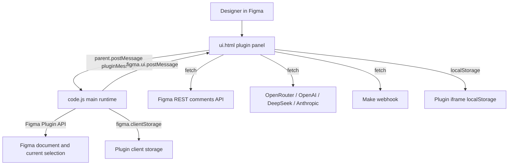
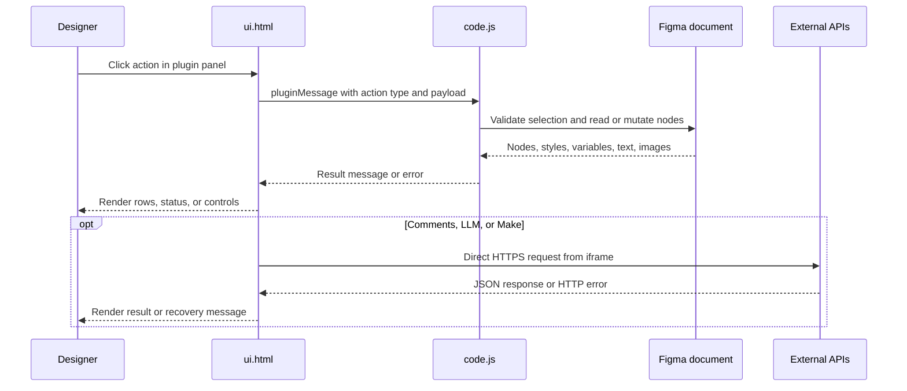

# OneManStudio Figma Plugin

Direct-load Figma plugin for independent designers. It combines style auditing,
cleanup utilities, frame renaming, detached component replacement, comment
lookup, and text copy workflows in one plugin panel.

There is no build step in this repository. Figma loads `code.js` as the main
plugin runtime and `ui.html` as the embedded UI.

## Run locally

1. In Figma, open **Plugins** -> **Development** -> **Import plugin from manifest...**.
2. Select this folder, or the `manifest.json` file inside it.
3. Run **OneManStudo - Swiss Army Knife for Independent Designers** from
   **Plugins** -> **Development**.

If Figma shows stale UI or permissions, remove and re-import the development
plugin. Manifest network and permission changes are picked up only after reload.

## Repository layout

| File | Purpose |
| --- | --- |
| `manifest.json` | Plugin metadata, entry points, Figma editor type, network allowlist, and `teamlibrary` permission. |
| `code.js` | Main Figma sandbox runtime. Reads/writes canvas nodes, imports library resources, stores frame-renamer settings in `figma.clientStorage`, and relays results back to the UI. |
| `ui.html` | Single-file plugin UI, styles, browser-side state, import/export, Make webhook calls, and LLM provider calls. |

## Runtime architecture





## Plugin capabilities

### Styler

Use when text or non-text layer fills need to be audited and remapped to shared
styles or variables.

- **Text tab** accepts exactly one selected `FRAME` or `GROUP`.
  - Scans descendant `TEXT` nodes with non-empty text.
  - Groups rows by direct color, paint style, or color variable.
  - Shows saved text style names where available; otherwise shows font family,
    size, and inferred weight.
  - Applies a selected paint style, color variable, or text style to checked
    text rows. If no row is checked, the dropdown action targets the current row.
- **Layers tab** accepts exactly one selected `FRAME` or `GROUP`.
  - Scans non-text nodes that expose fills.
  - Groups by direct fill color, paint style, or color variable.
  - Applies selected paint styles or variables to checked rows.

Style and variable pickers are populated from local styles, local color
variables, library color variables available through `teamlibrary`, and paint or
text styles already used in the document.

### Cleaner

Use when preparing handoff files or removing dead layers.

- Requires exactly one selected `FRAME`.
- Finds empty frames/groups, invisible layers, opacity-0 leaf layers, and layers
  without fill and stroke.
- Hidden layers are detected in source but filtered out of the displayed delete
  list.
- Selected findings can be deleted from the document.

### Frame Name

Use when a set of selected frames needs stable numbered names.

- Accepts one or more selected `FRAME` nodes.
- Prefix must contain only ASCII letters (`a-z`, `A-Z`) and is capped at 20
  stored characters.
- Output format is `Prefix-01`, `Prefix-02`, etc.
- Default order is canvas position: top to bottom, then left to right.
- Optional reverse layer-panel order walks the page tree bottom to top.
- Preferences are stored in `figma.clientStorage` under:
  - `rewriterPrefix`
  - `rewriterLayerPanelOrder`

### Detach seek

Use when replacing detached components or mapping local components to library
components.

- **Find detached** accepts one selected `FRAME` or `SECTION`.
  - Uses `detachedInfo` to list detached local or library component instances.
  - Suggestions prefer the detached parent component key when available, then
    name similarity against library components already present in the file.
  - Replacement preserves position, rotation, approximate size, and text
    contents when matching text layer names exist in the replacement instance.
- **Parse components** scans all pages for local components/component sets and
  library component instances.
  - Local component instances can be replaced with selected library components.
  - Library components are discoverable only when an instance exists in the
    document or can be imported by component key.

### Comments

Use to view Figma comments attached to nodes on the current page.

- The Comments panel is present in source but its menu item is hidden by CSS.
- Requires a Figma Personal Access Token with `file_comments:read`.
- Uses `figma.fileKey` when available, or a pasted file key/URL.
- Calls `GET https://api.figma.com/v1/files/{fileKey}/comments`.
- Filters comments to nodes found on `figma.currentPage`.
- Stores the token in iframe `localStorage` under `figma_plugin_token`.

### Text workflows

Use when editing copy, exporting localization rows, or preparing text for Make.

- Requires exactly one selected `FRAME`.
- Extracts descendant text rows as:

```json
{
  "id": "node-id",
  "key": "Frame Name_key-1",
  "value": "Visible text",
  "layerName": "Figma text layer name"
}
```

- Manual mode lets the user edit values and apply changes back to matching text
  nodes inside the extracted frame.
- Fonts are loaded before writes where Figma exposes a range font.
- CSV export writes `id,key,value`; it does not include `layerName`.
- JSON export writes `{ "frameId": "...", "items": [...] }`.
- Imports accept:
  - CSV with `value` and at least one of `id` or `key`.
  - JSON array, or object with an `items` array.
- Imports update only the UI rows first; the user must click **Apply changes**
  to write text back to Figma.
- **Apply changes** sends only `{ id, value }`. Edited or generated keys remain
  UI/export/Make metadata; they do not rename Figma layers or write plugin data.

### LLM-assisted text workflows

LLM mode uses a frame screenshot plus extracted text rows.

1. Select one frame and click **Extract text values**.
2. Open **LLM mode**, choose a provider, enter a vision-capable model and API
   key, then click **Save settings**.
3. Generate semantic keys, regenerate all copy, or focus/hover a row and use its
   **LLM** button.
4. Review the editable rows, then click **Apply changes** to update Figma copy.

- Supported provider selector values:
  - `openrouter` -> `https://openrouter.ai/api/v1/chat/completions`
  - `openai` -> `https://api.openai.com/v1/chat/completions`
  - `deepseek` -> `https://api.deepseek.com/chat/completions`
  - `claude` -> `https://api.anthropic.com/v1/messages`
- Default models:
  - OpenRouter: `openai/gpt-4o-mini`
  - OpenAI: `gpt-4o-mini`
  - DeepSeek: `deepseek-chat`
  - Claude: `claude-3-5-sonnet-20241022`
- **Generate semantic keys** asks the provider for lower-snake-case resource
  keys that describe screen structure and role, not visible copy. Keys are
  sanitized and de-duplicated before the list is updated.
- **Regenerate all copy (LLM)** and per-row **LLM** buttons ask the provider for
  improved copy. Results update the editable list only; users must review and
  click **Apply changes**.
- Manual/LLM mode controls only the visibility of provider settings. Once rows
  are extracted, batch regeneration and row **LLM** actions remain available in
  manual mode; the row action appears on row hover or keyboard focus.
- The main runtime exports the frame as a PNG data URL at scale `1` before the
  UI calls the provider. Per-row regeneration still sends the complete frame
  screenshot, but includes only the selected row in the text payload.
- OpenRouter, OpenAI, and DeepSeek receive an OpenAI-compatible request with a
  strict `json_schema` response format. Claude uses the Messages API and relies
  on prompt-enforced JSON instead.
- Model/provider compatibility is shown as a warning only; saving is blocked
  only when the API key is empty. Use a model that accepts image input and the
  provider's request format.

Provider profiles are stored in iframe `localStorage`:

| Key | Purpose |
| --- | --- |
| `openRouterProfilesByProviderV1` | Per-provider API key and model profiles. |
| `openRouterProviderV1` | Active provider. |
| `openRouterApiKeyV1` | Legacy/current fallback API key. |
| `openRouterModelV1` | Legacy/current fallback model. |
| `openAiApiKeyV1`, `openAiModelV1` | Legacy migration fallbacks. |
| `textModeV1` | `manual` or `llm`. |
| `textLlmSectionExpandedV1` | Collapsed/expanded LLM settings state. |

Each provider has a separate API key/model profile. Switching providers
persists the draft fields for the previous provider; **Save settings** also
updates the active-provider and legacy fallback keys.

### Make webhook sync

The Make setup view and handlers exist in source, but the visible **Connect
Make** entry point is not rendered in the current Text toolbar. If a scenario is
already stored in `localStorage`, **Sync current text to Make** can send rows
after text extraction.

Stored keys:

| Key | Purpose |
| --- | --- |
| `makeScenariosV1` | Saved scenarios with webhook URL, scenario key, target sheet, optional tab, optional secret, and default flag. |
| `makeActiveScenarioIdV1` | Active scenario id. |
| `figmaPluginUserIdV1` | Generated stable user id for webhook payloads. |

Webhook payload shape:

```json
{
  "event": "text_sync",
  "scenario_key": "marketing-copy",
  "target_sheet_id": "1AbCdEf...",
  "target_sheet_tab": "Sheet1",
  "plugin_user_id": "user-...",
  "frame_id": "123:456",
  "sent_at": "2026-07-13T16:01:18.230Z",
  "items": [
    {
      "id": "123:789",
      "key": "hero_block_title",
      "value": "Start your project",
      "layerName": "Heading"
    }
  ]
}
```

Connection tests send the same routing fields with `event: "connection_test"`
and an empty `items` array. The optional saved shared secret is not currently
included in headers or the JSON payload.

## Message contract

The UI communicates with the main runtime through `parent.postMessage(...)`; the
main runtime responds with `figma.ui.postMessage(...)`.

| UI -> main type | Main -> UI type | Notes |
| --- | --- | --- |
| `load` | `documentStyles` | Loads local text styles and paint styles used in the current selection. |
| `getStylesAndVariables` | `stylesAndVariablesResult` | Loads paint styles, text styles, local color variables, and library color variables. |
| `scan` | `scanResult` | Text fill/style scan for one frame or group. |
| `scanLayers` | `scanLayersResult` | Non-text fill scan for one frame or group. |
| `applyFillToGroup` | `applyFillToGroupResult` | Applies paint style or variable to node ids. |
| `applyTextStyleToGroup` | `applyTextStyleToGroupResult` | Applies text style to text node ids. |
| `findEmptyElements` | `cleanerResult` | Finds delete candidates in one frame. |
| `deleteNodes` | `cleanerDeleted` | Deletes provided node ids. |
| `findDetached` | `detachResult` | Lists detached components in one frame or section. |
| `parseComponents` | `parseComponentsResult` | Lists local and library components found across pages. |
| `replaceDetached` | `replaceDetachedResult`, `replaceDetachDebug` | Replaces selected detached nodes. |
| `replaceLocalWithLibrary` | `replaceLocalWithLibraryResult` | Replaces instances of local components with library imports. |
| `grabComments` | `commentsResult` | Calls Figma REST comments API and returns page comments. |
| `extractTextKeyValues` | `textKeyValuesResult` | Extracts text rows from one frame. |
| `captureFrameImageForLlm` | `frameImageForLlmResult` | Exports a frame PNG for LLM requests. |
| `updateTextKeyValues` | `textKeyValuesUpdated` | Writes text values back to nodes inside the extracted frame. |
| `getSelectionFramesCount` | `selectionFramesCount` | Updates Frame Name selected-frame count. |
| `getRewriterSettings` | `rewriterSettings` | Loads frame-renamer preferences. |
| `saveRewriterPrefix` | none | Stores sanitized prefix. |
| `saveRewriterLayerPanelOrder` | none | Stores order preference. |
| `renameFrames` | `renameFramesResult` | Renames selected frames. |
| `resize` | none | Resizes the plugin iframe, capped at 4000 x 4000. |
| `selectNode`, `selectNodes` | none | Selects nodes on canvas while preserving viewport for multi-select. |
| `close` | none | Closes the plugin. |

## Manifest permissions and network access

`manifest.json` currently allows:

- `https://api.figma.com`
- `https://openrouter.ai`
- `https://hook.make.com`
- `https://www.make.com`
- `https://eu1.make.com`
- `https://us1.make.com`

It also requests `teamlibrary` so the plugin can read available library variable
collections.

Important constraint: native OpenAI, DeepSeek, and Anthropic endpoints are used
by `ui.html`, but their domains are not currently listed in
`networkAccess.allowedDomains`. In Figma, those providers may fail until the
manifest allowlist includes their API domains and the development plugin is
re-imported.

## Common pitfalls

- **"Select exactly one frame or group."** Styler scans require one `FRAME` or
  `GROUP`; Text and Cleaner require one `FRAME`; Detach seek accepts one
  `FRAME` or `SECTION`.
- **No library colors or variables.** Confirm the manifest includes
  `permissions: ["teamlibrary"]`, reload the plugin, and ensure the team library
  is available to the current file.
- **Native LLM providers fail.** Add the provider domain to
  `networkAccess.allowedDomains` and reload the development plugin. OpenRouter
  is the only LLM domain allowlisted today.
- **LLM request fails after changing selection.** LLM actions use the frame id
  captured by the last extraction. Re-select the intended frame and extract
  again.
- **Provider accepts the key but rejects the request.** Confirm the model id is
  native to the selected provider and supports image input plus the required
  JSON response behavior. The settings warning does not block incompatible
  combinations.
- **Row LLM action is missing.** Hover the row or focus one of its controls.
  The action can also be used while the panel is in manual mode.
- **LLM output did not update Figma.** LLM results update the editable list
  first. Click **Apply changes** to write to text nodes.
- **Semantic keys did not rename layers.** Keys are list/export/Make metadata.
  Applying changes writes text values only.
- **Make sync button stays disabled.** Extract text rows first and ensure an
  active Make scenario exists in `makeScenariosV1`.
- **Make secret validation never fires.** The optional secret is stored with the
  scenario but is not sent in the current request.
- **Comments return 403.** Use a Figma token with `file_comments:read` and
  access to the file.
- **Comments return 404 or missing file key.** Paste a file key or full Figma
  file/design URL from the browser; unsaved files may not have an accessible key.
- **Frame renaming rejects a prefix.** Prefixes must be letters only. Spaces,
  digits, punctuation, and non-ASCII letters are stripped or rejected.

## Development notes

- Keep this as a direct-load plugin unless a build pipeline is added.
- Prefer updating `README.md` for operational behavior changes; there are no
  separate docs pages in this repo today.
- When adding a new UI action, update the message contract table and document
  selection requirements, storage keys, and network domains.
- When adding a new external API call, update `manifest.json` and the network
  access section together.
