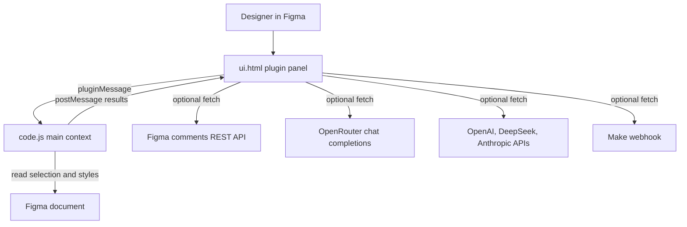
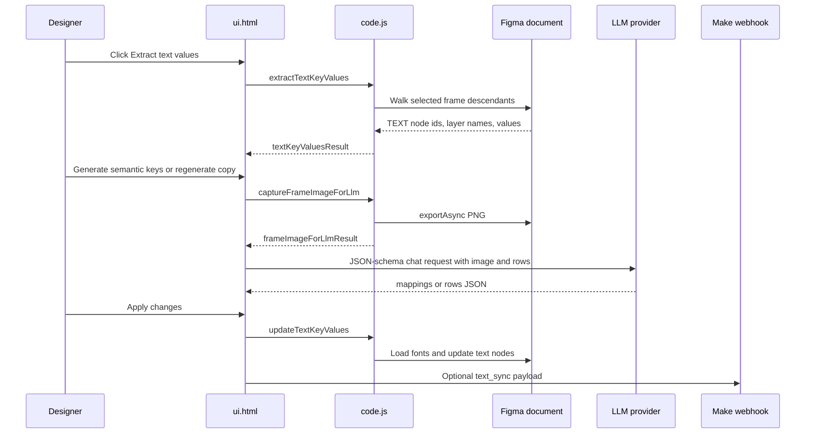

# OneManStudio Figma Plugin

Single-file Figma plugin for inspecting design-system drift, editing frame text,
generating LLM-assisted text metadata/copy, cleaning empty layers, renaming
frames, and replacing detached components.

There is no build step in this repository. Figma loads `manifest.json`,
`code.js`, and `ui.html` directly.

## Run locally in Figma

1. In Figma, open **Plugins -> Development -> Import plugin from manifest...**.
2. Select this repository's `manifest.json`.
3. Run **OneManStudo - Swiss Army Knife for Independent Designers** from the
   development plugins list.
4. Select the target frame/group/section before using workflows that require a
   canvas selection.

## Repository structure

| File | Purpose |
| --- | --- |
| `manifest.json` | Plugin metadata, Figma API version, entry points, network allowlist, and `teamlibrary` permission. |
| `code.js` | Figma main-thread code. Reads/writes canvas nodes, loads styles/variables, exports frame screenshots, and responds to UI messages. |
| `ui.html` | Plugin panel markup, styles, browser-side state, external API calls, import/export helpers, and user interaction handlers. |

## Architecture





## Main workflows

### Styler

Use for finding text and layer fills that are not aligned to shared styles or
variables.

- **Text tab**: select exactly one frame or group, then click **Scan unlinked
  color styles**.
  - Groups descendant `TEXT` nodes by fill source: local color, fill style, or
    bound color variable.
  - Adds text-style context where available: saved text style name, or unsaved
    font family, size, and weight.
  - Lets selected rows receive a paint style, color variable, or text style.
- **Layers tab**: select exactly one frame or group, then click **Scan fill
  colors**.
  - Scans non-text nodes that expose `fills`.
  - Groups by local color, paint style, or bound color variable.
  - Lets selected rows receive a paint style or color variable.

Constraints:

- Empty text nodes are ignored by text fill scans.
- Mixed fills/styles are reduced to the first readable solid paint where the
  Figma API allows it.
- Library variables depend on the `teamlibrary` permission in `manifest.json`.

### Cleaner

Use for removing low-signal nodes from a selected frame.

- Requires exactly one selected `FRAME`.
- Finds empty frames/groups, opacity `0` leaves, hidden leaves, and leaves with
  empty fill/stroke.
- The current result filters out `Hidden` before showing deletable rows.
- Delete uses node ids from the scan result and removes nodes from the canvas.

### Frame Name

Use for batch renaming selected frames.

- Select one or more `FRAME` nodes.
- Prefix must contain letters only (`a-z`, `A-Z`) and is stored in
  `figma.clientStorage` as `rewriterPrefix`.
- Names are generated as `Prefix-01`, `Prefix-02`, etc.
- Default order is canvas position: top to bottom, then left to right.
- Optional stored setting `rewriterLayerPanelOrder` switches to layer-panel
  traversal order.

### Detach seek

Use for finding detached components inside a frame or section and replacing them
with library components.

- **Find detached** requires exactly one selected `FRAME` or `SECTION`.
- Results use `detachedInfo` when available.
- Suggestions prefer the original library component key, then fall back to
  name similarity against library component instances already discoverable in
  the document.
- Replacement tries, in order:
  1. Clone an existing matching instance in the document.
  2. Create an instance from a matching local component.
  3. Import a component by key with `figma.importComponentByKeyAsync`.
- Replacement preserves x/y, rotation, approximate size, and matching text-node
  contents by text layer name.

Hidden implementation note:

- `Parse components` and "replace local with library" handlers still exist, but
  their UI is hidden by CSS.

### Comments

The comments panel and handler remain in the code, but the sidebar entry is
hidden by CSS (`.menu-item[data-panel="4"] { display: none; }`).

When enabled, it:

- Stores a Figma personal access token in `localStorage` under
  `figmaTokenV1`.
- Calls `GET https://api.figma.com/v1/files/{fileKey}/comments` with
  `X-Figma-Token`.
- Filters results to comments attached to nodes on the current page.

The token needs Figma REST access to file comments, including the
`file_comments:read` scope.

## Text panel

The Text panel is the most integration-heavy workflow.

### Manual text editing

1. Select exactly one `FRAME`.
2. Click **Extract text values**.
3. Edit extracted row values in the list.
4. Click **Apply changes**.

Extraction walks all descendants of the selected frame and returns rows:

```json
{
  "id": "node-id",
  "key": "FrameName_key-1",
  "value": "Visible text",
  "layerName": "Layer name"
}
```

Apply sends `{ id, value }` updates back to `code.js`. The main thread verifies
that every id still belongs to the extracted frame, loads each text node's font
when possible, and then writes `node.characters`.

### Import and export

Export CSV:

```csv
id,key,value
1:2,screen_title,Welcome
1:3,primary_cta,Continue
```

Export JSON:

```json
{
  "frameId": "1:1",
  "items": [
    {
      "id": "1:2",
      "key": "screen_title",
      "value": "Welcome"
    }
  ]
}
```

Import accepts either:

- CSV with `value` plus at least one of `id` or `key`.
- JSON as an array of rows or an object with an `items` array.

Imported values update the panel inputs only. The user must click **Apply
changes** to write them to Figma.

### LLM semantic keys

LLM mode can generate stable localization/resource keys for extracted text rows.

Flow:

1. Extract text values from a frame.
2. Switch to **LLM mode**.
3. Choose provider and save API key/model.
4. Click **Generate semantic keys**.
5. Review generated keys, then export/sync/apply as needed.

The main thread exports the selected frame as a PNG data URL. The panel sends
the screenshot plus rows to the selected provider and requires a JSON response:

```json
{
  "mappings": [
    {
      "sourceId": "1:2",
      "suggestedKey": "hero_block_title",
      "reason": "hero - primary heading"
    }
  ]
}
```

Returned keys are normalized to lower snake case, ASCII letters/digits/underscores
only, prefixed with `k_` if they start with a digit, and deduplicated with a
numeric suffix.

### LLM copy regeneration

LLM mode can regenerate all extracted copy or a single row.

Expected provider response:

```json
{
  "rows": [
    {
      "sourceId": "1:2",
      "suggestedText": "Start your project",
      "reason": "clearer action"
    }
  ]
}
```

Generated copy updates the panel list only. The user must click **Apply
changes** to write it to Figma.

### Supported LLM providers

| Provider option | Endpoint used by `ui.html` | Default model |
| --- | --- | --- |
| OpenRouter | `https://openrouter.ai/api/v1/chat/completions` | `openai/gpt-4o-mini` |
| OpenAI | `https://api.openai.com/v1/chat/completions` | `gpt-4o-mini` |
| DeepSeek | `https://api.deepseek.com/chat/completions` | `deepseek-chat` |
| Claude | `https://api.anthropic.com/v1/messages` | `claude-3-5-sonnet-20241022` |

Operational constraint:

- `manifest.json` currently allowlists OpenRouter and Make/Figma domains, but
  not the native OpenAI, DeepSeek, or Anthropic domains. Native provider calls
  may be blocked by Figma network access until those domains are added.

Stored LLM settings:

- Active provider: `openRouterProviderV1`
- Legacy active API key/model: `openRouterApiKeyV1`, `openRouterModelV1`
- Provider profiles: `openRouterProfilesByProviderV1`
- Legacy migration fallback: `openAiApiKeyV1`, `openAiModelV1`
- Text mode: `textModeV1`
- LLM panel expanded state: `textLlmSectionExpandedV1`

## Make webhook integration

The Make sync code is present, but the visible **Connect Make** entry point has
been removed from the Text toolbar. The sync button only enables if an active
scenario already exists in `localStorage`.

Stored Make keys:

- Scenarios: `makeScenariosV1`
- Active scenario id: `makeActiveScenarioIdV1`
- Generated plugin user id: `figmaPluginUserIdV1`

Scenario fields:

```json
{
  "id": "scenario-...",
  "isDefault": true,
  "name": "Marketing EN",
  "webhookUrl": "https://hook.make.com/...",
  "scenarioKey": "marketing-copy",
  "targetSheetId": "1AbCdEf...",
  "targetSheetTab": "Sheet1",
  "secret": "optional"
}
```

Connection test payload:

```json
{
  "event": "connection_test",
  "scenario_key": "marketing-copy",
  "target_sheet_id": "1AbCdEf...",
  "target_sheet_tab": "Sheet1",
  "plugin_user_id": "user-...",
  "sent_at": "2026-06-29T16:00:00.000Z",
  "items": []
}
```

Text sync payload:

```json
{
  "event": "text_sync",
  "scenario_key": "marketing-copy",
  "target_sheet_id": "1AbCdEf...",
  "target_sheet_tab": "Sheet1",
  "plugin_user_id": "user-...",
  "frame_id": "1:1",
  "sent_at": "2026-06-29T16:00:00.000Z",
  "items": [
    {
      "id": "1:2",
      "key": "hero_block_title",
      "value": "Start your project",
      "layerName": "Hero title"
    }
  ]
}
```

Constraints:

- The webhook URL must be HTTPS.
- `scenario_key` and `target_sheet_id` are required.
- The optional `secret` is stored with the scenario but is not sent in the
  current request body or headers.
- Make status and setup status elements are intentionally hidden and cleared by
  the current UI code.

## UI-to-main message contract

`ui.html` communicates with `code.js` using `parent.postMessage` with
`pluginMessage.type`.

| Message type | Direction | Purpose |
| --- | --- | --- |
| `resize` | UI -> main | Resize the plugin window. |
| `load` | UI -> main | Load local text styles and paint styles used in selection. |
| `getStylesAndVariables` | UI -> main | Load local/used paint styles, text styles, and local/library color variables. |
| `scan` / `scanResult` | UI <-> main | Scan selected frame/group text fills. |
| `scanLayers` / `scanLayersResult` | UI <-> main | Scan selected frame/group non-text fills. |
| `applyFillToGroup` / `applyFillToGroupResult` | UI <-> main | Apply a paint style or color variable to selected nodes. |
| `applyTextStyleToGroup` / `applyTextStyleToGroupResult` | UI <-> main | Apply a text style to selected text nodes. |
| `findEmptyElements` / `cleanerResult` | UI <-> main | Find deletable empty/transparent/no-fill nodes. |
| `deleteNodes` / `cleanerDeleted` | UI <-> main | Delete selected cleaner result nodes. |
| `findDetached` / `detachResult` | UI <-> main | Find detached components and suggestions. |
| `replaceDetached` / `replaceDetachedResult` | UI <-> main | Replace detached nodes with library component instances. |
| `parseComponents` / `parseComponentsResult` | UI <-> main | Hidden workflow for mapping local components to library components. |
| `replaceLocalWithLibrary` / `replaceLocalWithLibraryResult` | UI <-> main | Hidden workflow for replacing local instances. |
| `grabComments` / `commentsResult` | UI <-> main | Hidden comments workflow via Figma REST API. |
| `selectNode`, `selectNodes` | UI -> main | Select one or more canvas nodes without changing viewport center. |
| `extractTextKeyValues` / `textKeyValuesResult` | UI <-> main | Extract text rows from a selected frame. |
| `captureFrameImageForLlm` / `frameImageForLlmResult` | UI <-> main | Export the extracted frame as PNG data URL for LLM prompts. |
| `updateTextKeyValues` / `textKeyValuesUpdated` | UI <-> main | Apply edited text values back to Figma. |
| `getSelectionFramesCount` / `selectionFramesCount` | UI <-> main | Count selected frames for the Frame Name panel. |
| `getRewriterSettings`, `saveRewriterPrefix`, `saveRewriterLayerPanelOrder` | UI -> main | Load/save frame-renaming preferences in `figma.clientStorage`. |
| `renameFrames` / `renameFramesResult` | UI <-> main | Rename selected frames. |

## Network access

Current `manifest.json` allowlist:

- `https://api.figma.com`
- `https://openrouter.ai`
- `https://hook.make.com`
- `https://www.make.com`
- `https://eu1.make.com`
- `https://us1.make.com`

If a new external API is added in `ui.html`, add its origin to
`networkAccess.allowedDomains` or Figma may block requests.

## Troubleshooting

| Symptom | Likely cause | Fix |
| --- | --- | --- |
| "Select exactly one frame/group" | Required canvas selection is missing or wrong node type. | Select the type named in the error and rerun the action. |
| LLM says "Save your API key first" | Provider profile is empty. | Enter API key/model in LLM mode and click **Save settings**. |
| Native OpenAI/DeepSeek/Claude request fails before reaching provider | Domain is not allowlisted in `manifest.json`. | Add the provider origin to `networkAccess.allowedDomains` and reload the plugin. |
| Text apply silently skips a row | Node was removed, no longer belongs to the extracted frame, or font loading failed. | Extract again from the current frame and retry. |
| Make sync button stays disabled | No active Make scenario exists in `localStorage`, or no text rows are extracted. | Seed/restore a scenario or re-enable the setup entry point, then extract text rows. |
| Make shared secret is not received | Current code stores `secret` but does not send it. | Extend `sendPayloadToMake` to include a header/body signature before relying on it. |
| Library variables are missing | `teamlibrary` permission or available library variable APIs are unavailable. | Verify `manifest.json` permissions and reload the plugin. |

## Developer notes

- Keep documentation changes source-verified; this plugin has several hidden UI
  surfaces whose handlers still exist.
- Prefer updating this README unless a new doc becomes large enough to justify a
  separate `docs/` page.
- Because there is no package manager or automated test harness, verification is
  primarily source review plus manual plugin loading in Figma.
