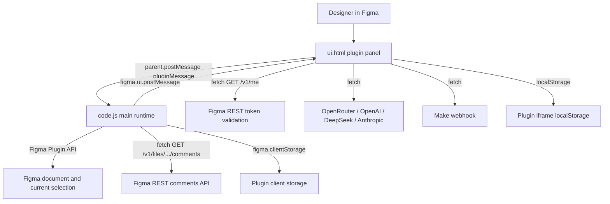
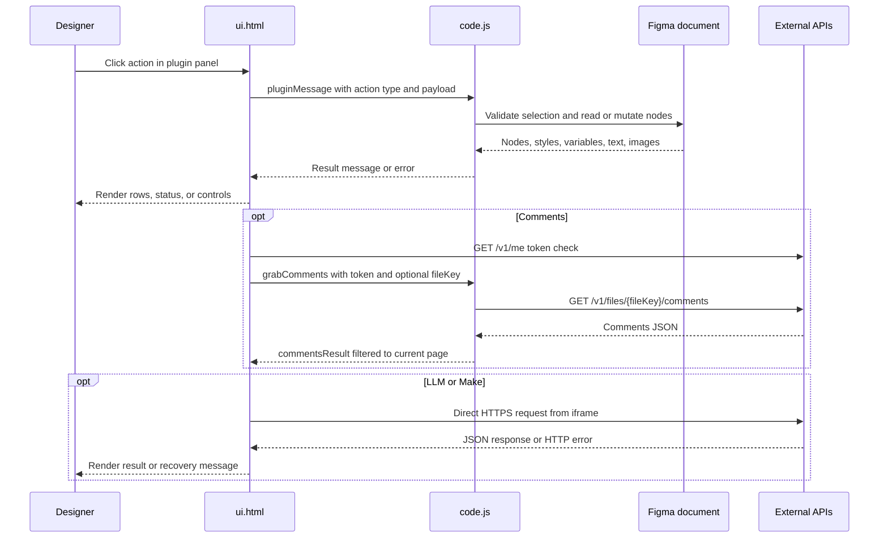

# OneManStudio Figma Plugin

Direct-load Figma plugin for independent designers. It combines style auditing,
cleanup utilities, frame renaming, detached component replacement, comment
lookup, and text copy workflows in one plugin panel.

There is no build step in this repository. Figma loads `code.js` as the main
plugin runtime and `ui.html` as the embedded UI.

## Run locally

1. In Figma, open **Plugins** → **Development** → **Import plugin from manifest…**.
2. Select this folder, or the `manifest.json` file inside it.
3. Run **OneManStudo — Swiss Army Knife for Independent Designers** from
   **Plugins** → **Development**.

If Figma shows stale UI or permissions, remove and re-import the development
plugin. Manifest network and permission changes are picked up only after reload.

### Window sizes

| Mode | Size | Source |
| --- | --- | --- |
| Initial `figma.showUI` | `760 × 640` | `code.js` |
| UI restore / expand | `759 × 640` | `ui.html` (`PLUGIN_W` / `PLUGIN_H`) |
| Minimize | `230 × 48` | `#menuMinimize` |
| UI drag resize clamp | max `1200 × 900`, min `230 × 48` | `ui.html` |
| Main hard-cap | max `4000 × 4000` | `code.js` `resize` handler |

## Repository layout

| File | Purpose |
| --- | --- |
| `manifest.json` | Plugin metadata, entry points, Figma editor type, network allowlist, and `teamlibrary` permission. |
| `code.js` | Main Figma sandbox runtime. Reads/writes canvas nodes, imports library resources, stores frame-renamer settings in `figma.clientStorage`, fetches Figma comments, and relays results back to the UI. |
| `ui.html` | Single-file plugin UI, styles, browser-side state, import/export, Make webhook calls, LLM provider calls, and Figma token validation. |

## Runtime architecture





## Plugin capabilities

### Styler

Use when text or non-text layer fills need to be audited and remapped to shared
styles or variables.

- **Text tab** accepts exactly one selected `FRAME` or `GROUP`.
  - Scans descendant `TEXT` nodes with non-empty text.
  - Groups rows by direct color, paint style, or color variable.
  - Shows saved text style names where available; otherwise shows font family,
    size, and inferred weight.
  - Applies a selected paint style, color variable, or text style to checked
    text rows. If no row is checked, the dropdown action targets the current row.
- **Layers tab** accepts exactly one selected `FRAME` or `GROUP`.
  - Scans non-text nodes that expose fills.
  - Groups by direct fill color, paint style, or color variable.
  - Applies selected paint styles or variables to checked rows.

Style and variable pickers come from two paths:

1. Boot / legacy `documentStyles`: paint styles collected from TEXT fills inside
   the current selection when that selection is one `FRAME` or `GROUP`.
2. Scan-time `getStylesAndVariables`: local paint/text styles, document-used
   paint styles, page-used text styles, plus local and library color variables
   available through `teamlibrary`.

`applyFillToGroupResult` / `applyTextStyleToGroupResult` report
`applied: nodeIds.length` for the requested set. Individual node failures are
not subtracted; a failed variable import can return `applied: 0`.

Note: the UI still references a `#hideLocalStyle` checkbox that is not present in
the current markup, so the “hide local style” filter cannot be toggled from the
panel today.

### Cleaner

Use when preparing handoff files or removing dead layers.

- Requires exactly one selected `FRAME`.
- Finds empty frames/groups, invisible layers, opacity-0 leaf layers, and layers
  without fill and stroke.
- Hidden layers are detected in source but filtered out of the displayed delete
  list (`reason !== "Hidden"`).
- Selected findings can be deleted from the document.

### Frame Name

Use when a set of selected frames needs stable numbered names.

- Accepts one or more selected `FRAME` nodes (any selected frames, not only
  page top-level children).
- Prefix must contain only ASCII letters (`a-z`, `A-Z`) and is capped at 20
  stored characters.
- Output format is `Prefix-01` … `Prefix-09`, then `Prefix-10`, `Prefix-11`, …
  (zero-pad only below 10).
- Default order is canvas position: top to bottom, then left to right.
- Optional reverse layer-panel order walks the page tree bottom to top.
- Preferences are stored in `figma.clientStorage` under:
  - `rewriterPrefix`
  - `rewriterLayerPanelOrder`

The selected-frame count is shown on the Rename button
(`Rename frames (N)`). `#rewriterFramesCount` is missing from markup, so there
is no separate count label. `#btnRefreshFramesCount` exists but is CSS-hidden;
selection-change messages still refresh the button label.

### Detach seek

Use when replacing detached components or mapping local components to library
components.

- **Find detached** accepts one selected `FRAME` or `SECTION`.
  - Uses `detachedInfo` to list detached local or library component instances.
  - Suggestions prefer the detached parent component key when available, then
    name similarity against library components already present in the file
    (import-by-key fallback when needed).
  - Replacement preserves position, rotation, approximate size, and text
    contents when matching text layer names exist in the replacement instance.
  - `DEBUG = true` posts frequent `figma.notify("[Detach] …")` messages and
    `replaceDetachDebug` events. `#detachDebug` is CSS-hidden in the panel.
  - Success `replaced` counts the requested replacement list length, including
    entries skipped for missing `nodeId` / `componentKey`.
- **Parse components** logic remains in `code.js` / `ui.html`, but the Parse
  components button, debug output, and parse result sections are hidden by CSS.
  Local→library replacement handlers still exist for that dormant UI path.

### Comments

Use to view Figma comments attached to nodes on the current page.

- The Comments panel is present in source but its menu item is hidden by CSS
  (`.menu-item[data-panel="4"] { display: none; }`).
- Authorize in the UI with a Figma Personal Access Token
  (`GET https://api.figma.com/v1/me`). Token is stored under `figma_plugin_token`.
- Grab comments sends `grabComments` to the main runtime, which calls
  `GET https://api.figma.com/v1/files/{fileKey}/comments` with `X-Figma-Token`.
- Uses `figma.fileKey` when available, or a pasted file key/URL
  (`/file/` or `/design/` paths are parsed).
- Keeps only comments whose `client_meta.node_id` resolves to a node on
  `figma.currentPage`. Pin/file-level comments without a node id are dropped.
- Token scope needed for comments: `file_comments:read`.

### Text workflows

Use when editing copy, exporting localization rows, or preparing text for Make.

- Requires exactly one selected `FRAME`.
- Extracts all descendant `TEXT` layers, including empty ones, as:

```json
{
  "id": "node-id",
  "key": "Frame Name_key-1",
  "value": "Visible text",
  "layerName": "Figma text layer name"
}
```

- Default keys are `{frameName}_key-{n}` placeholders until semantic keys are
  generated or edited in the UI.
- Manual mode lets the user edit values and apply changes back to matching text
  nodes inside the extracted frame.
- Fonts are loaded before writes where Figma exposes a range font. Nodes that
  fail font load are skipped without incrementing `skipped` (the write path
  catches the failure and continues). Invalid ids / out-of-frame ids do
  increment `skipped`. The UI status shows “Updated N…” then re-extracts.
- CSV export writes `id,key,value`; it does not include `layerName`.
- JSON export writes `{ "frameId": "...", "items": [...] }` (includes
  `layerName` on each item when present).
- Imports accept:
  - CSV with `value` and at least one of `id` or `key`.
  - JSON array, or object with an `items` array.
- Import matching prefers `id`, then falls back to `key`.
- Imports write **values only** into the editable inputs. Imported `key`
  fields do not update UI keys.
- Imports update only the UI rows first; the user must click **Apply changes**
  to write text back to Figma.
- **Apply changes** sends `{ frameId, updates: [{ id, value }] }`. Edited or
  generated keys remain UI/export/Make metadata; they do not rename Figma
  layers or write plugin data.

### LLM-assisted text workflows

LLM mode uses a frame screenshot plus extracted text rows.

1. Select one frame and click **Extract text values**.
2. Open **LLM mode**, choose a provider, enter a vision-capable model and API
   key, then click **Save settings**.
3. Generate semantic keys, regenerate all copy, or focus/hover a row and use its
   **LLM** button.
4. Review the editable rows, then click **Apply changes** to update Figma copy.

| Provider id | Endpoint | Default model |
| --- | --- | --- |
| `openrouter` | `https://openrouter.ai/api/v1/chat/completions` | `openai/gpt-4o-mini` |
| `openai` | `https://api.openai.com/v1/chat/completions` | `gpt-4o-mini` |
| `deepseek` | `https://api.deepseek.com/chat/completions` | `deepseek-chat` |
| `claude` | `https://api.anthropic.com/v1/messages` | `claude-3-5-sonnet-20241022` |

- **Generate semantic keys** asks the provider for lower-snake-case resource
  keys that describe screen structure and role, not visible copy. Keys are
  sanitized (`non-alnum → _`, leading digit → `k_…`) and de-duplicated with
  `_2`, `_3`, … before the list is updated.
- **Regenerate all copy (LLM)** and per-row **LLM** buttons ask the provider for
  improved copy. Results update the editable list only; users must review and
  click **Apply changes**.
- Manual/LLM mode controls only the visibility of provider settings. Once rows
  are extracted, batch regeneration and row **LLM** actions remain available in
  manual mode; the row action appears on row hover or keyboard focus.
- The main runtime exports the frame as a PNG data URL at scale `1` before the
  UI calls the provider. Per-row regeneration still sends the complete frame
  screenshot, but includes only the selected row in the text payload.
- OpenRouter, OpenAI, and DeepSeek receive an OpenAI-compatible request with a
  strict `json_schema` response format. Claude uses the Messages API
  (`x-api-key`, `anthropic-version: 2023-06-01`) and relies on prompt-enforced
  JSON instead.
- OpenRouter requests also send
  `HTTP-Referer: https://www.figma.com` and
  `X-Title: OneManStudio Figma Plugin`.
- Model/provider compatibility is shown as a warning only; saving is blocked
  only when the API key is empty. Use a model that accepts image input and the
  provider's request format.

#### LLM request / response row shapes

Copy regeneration sends rows shaped as:

```json
{
  "sourceId": "123:789",
  "figmaLayerName": "Heading",
  "resourceKey": "hero_block_title",
  "currentUiCopy": "Start your project"
}
```

Expected response:

```json
{
  "rows": [
    {
      "sourceId": "123:789",
      "suggestedText": "Ship your next project",
      "reason": "Clearer CTA tone"
    }
  ]
}
```

Semantic key generation sends:

```json
{
  "sourceId": "123:789",
  "figmaLayerName": "Heading",
  "pluginPlaceholderKey": "Frame Name_key-1",
  "draftUiCopy": "Start your project"
}
```

Expected response:

```json
{
  "mappings": [
    {
      "sourceId": "123:789",
      "suggestedKey": "hero_block_title",
      "reason": "Primary heading"
    }
  ]
}
```

Provider profiles are stored in iframe `localStorage`:

| Key | Purpose |
| --- | --- |
| `openRouterProfilesByProviderV1` | Per-provider profiles: `{ [providerId]: { apiKey, model } }`. |
| `openRouterProviderV1` | Active provider. |
| `openRouterApiKeyV1` | Legacy/current fallback API key. |
| `openRouterModelV1` | Legacy/current fallback model. |
| `openAiApiKeyV1`, `openAiModelV1` | Legacy migration fallbacks. |
| `textModeV1` | `manual` or `llm`. |
| `textLlmSectionExpandedV1` | Collapsed/expanded LLM settings state. |
| `pluginUiThemeV1` | Light/dark UI theme preference. |

Each provider has a separate API key/model profile. Switching providers
persists the draft fields for the previous provider; **Save settings** also
updates the active-provider and legacy fallback keys.

### Make webhook sync

The Make setup view and handlers exist in `ui.html`, but there is no
`btnConnectMake` element in the current markup, so the setup screen is not
reachable from the Text toolbar. Dead copy still says “Click Connect Make.”

Make status is effectively disabled twice:

1. `#makeStatus` / `#makeSetupStatus` are CSS-forced hidden.
2. `setMakeStatus` / `setMakeSetupStatus` always clear `textContent` and ignore
   the message argument.

If a scenario is already present in `localStorage`, **Sync current text to Make**
can still POST rows after text extraction. Operators must pre-seed storage or
temporarily restore the Connect Make control to configure scenarios.

Stored keys:

| Key | Purpose |
| --- | --- |
| `makeScenariosV1` | Saved scenarios. |
| `makeActiveScenarioIdV1` | Active scenario id. |
| `figmaPluginUserIdV1` | Generated stable user id for webhook payloads. |

Scenario object fields:

| Field | Notes |
| --- | --- |
| `id` | Stable scenario id. |
| `name` | Display name. |
| `webhookUrl` | Must be `https://…`. |
| `scenarioKey` | Routing key for Make. |
| `targetSheetId` | Destination sheet id. |
| `targetSheetTab` | Optional tab name. |
| `secret` | Optional; stored but **never** sent in headers or body. |
| `isDefault` | Default-scenario flag. |

`text_sync` webhook payload:

```json
{
  "event": "text_sync",
  "scenario_key": "marketing-copy",
  "target_sheet_id": "1AbCdEf...",
  "target_sheet_tab": "Sheet1",
  "plugin_user_id": "user-...",
  "frame_id": "123:456",
  "sent_at": "2026-08-10T16:00:00.000Z",
  "items": [
    {
      "id": "123:789",
      "key": "hero_block_title",
      "value": "Start your project",
      "layerName": "Heading"
    }
  ]
}
```

`connection_test` sends the same routing fields with `event: "connection_test"`,
an empty `items` array, and **no** `frame_id`. Requests use
`Content-Type: application/json` only.

Webhook hosts must match `manifest.json` `networkAccess.allowedDomains` (for
example `https://hook.make.com`, `https://eu1.make.com`, `https://us1.make.com`).
`https://www.make.com` is allowlisted but unused by current `fetch` calls.
Custom or undocumented Make regions will fail at Figma's network gate.

## Message contract

The UI communicates with the main runtime through `parent.postMessage(...)`; the
main runtime responds with `figma.ui.postMessage(...)`.

| UI → main type | Main → UI type | Notes |
| --- | --- | --- |
| `load` | `documentStyles` | Handled in main, but no UI sender today. Boot already auto-posts `documentStyles`. |
| `getStylesAndVariables` | `stylesAndVariablesResult` | Paint styles, text styles, local color variables, and library color variables. |
| `scan` | `scanResult` | Text fill/style scan for one frame or group. |
| `scanLayers` | `scanLayersResult` | Non-text fill scan for one frame or group. |
| `applyFillToGroup` | `applyFillToGroupResult` | Applies paint style or variable to node ids. Count is request-sized. |
| `applyTextStyleToGroup` | `applyTextStyleToGroupResult` | Applies text style to text node ids. Count is request-sized. |
| `findEmptyElements` | `cleanerResult` | Finds delete candidates in one frame. |
| `deleteNodes` | `cleanerDeleted` | Deletes provided node ids. |
| `findDetached` | `detachResult` | Lists detached components in one frame or section. |
| `parseComponents` | `parseComponentsResult` | Lists local and library components found across pages (UI path currently hidden). |
| `replaceDetached` | `replaceDetachedResult`, `replaceDetachDebug` | Replaces selected detached nodes. |
| `replaceLocalWithLibrary` | `replaceLocalWithLibraryResult` | Replaces instances of local components with library imports (UI path currently hidden). |
| `grabComments` | `commentsResult` | Main runtime calls Figma REST comments API and returns page-filtered comments. |
| `extractTextKeyValues` | `textKeyValuesResult` | Extracts text rows from one frame (includes empty TEXT nodes). |
| `captureFrameImageForLlm` | `frameImageForLlmResult` | Exports a frame PNG for LLM requests. |
| `updateTextKeyValues` | `textKeyValuesUpdated` | Writes text values; returns `updated` / `attempted` / `skipped`. |
| `getSelectionFramesCount` | `selectionFramesCount` | Frame count for Frame Name button label. |
| `getRewriterSettings` | `rewriterSettings` | Loads frame-renamer preferences. |
| `saveRewriterPrefix` | none | Stores sanitized prefix. |
| `saveRewriterLayerPanelOrder` | none | Stores order preference. |
| `renameFrames` | `renameFramesResult` | Renames selected frames. |
| `resize` | none | Resizes the plugin iframe, capped at 4000 × 4000. |
| `selectNode`, `selectNodes` | none | Selects nodes on canvas while preserving viewport for multi-select. |
| `close` | none | Handled in main (`figma.closePlugin`), but no UI sender today. |

On plugin open, the main runtime also auto-posts `documentStyles` once without
waiting for a `load` message. Selection changes auto-post `selectionFramesCount`.

The UI still listens for a legacy `textStyles` message type, but the main runtime
never posts it; style data arrives through `documentStyles` and
`stylesAndVariablesResult`.

## Storage keys

### `figma.clientStorage`

| Key | Purpose |
| --- | --- |
| `rewriterPrefix` | Frame Name prefix. |
| `rewriterLayerPanelOrder` | Frame Name order preference. |

### iframe `localStorage`

| Key | Purpose |
| --- | --- |
| `pluginUiThemeV1` | Light/dark theme. |
| `figma_plugin_token` | Figma PAT for Comments auth. |
| `openRouterProfilesByProviderV1` | Per-provider LLM profiles. |
| `openRouterProviderV1` | Active LLM provider. |
| `openRouterApiKeyV1` / `openRouterModelV1` | Active/legacy LLM fallbacks. |
| `openAiApiKeyV1` / `openAiModelV1` | Legacy OpenAI migration keys. |
| `textModeV1` | `manual` or `llm`. |
| `textLlmSectionExpandedV1` | LLM settings expand state. |
| `makeScenariosV1` | Make scenario list. |
| `makeActiveScenarioIdV1` | Active Make scenario id. |
| `figmaPluginUserIdV1` | Stable plugin user id for Make payloads. |

## Manifest permissions and network access

`manifest.json` currently allows:

- `https://api.figma.com`
- `https://openrouter.ai`
- `https://hook.make.com`
- `https://www.make.com`
- `https://eu1.make.com`
- `https://us1.make.com`

It also requests `teamlibrary` so the plugin can read available library variable
collections, and sets `documentAccess: "dynamic-page"`.

Important constraint: native OpenAI, DeepSeek, and Anthropic endpoints are used
by `ui.html`, but their domains are not currently listed in
`networkAccess.allowedDomains`. In Figma, those providers may fail until the
manifest allowlist includes their API domains and the development plugin is
re-imported. OpenRouter is the only LLM host allowlisted today.

## Hidden / dormant UI surfaces

These paths still exist in source but are not exposed in the default panel:

| Surface | How it is hidden | Runtime status |
| --- | --- | --- |
| Comments menu | CSS hides `data-panel="4"` | Handlers active if panel is shown manually |
| Parse components / local→library | CSS hides button and result sections | Message handlers still active |
| Connect Make | `btnConnectMake` removed from markup | Setup view + sync handlers remain; sync needs pre-seeded scenarios |
| Make status text | CSS-hidden **and** JS setters clear text | Sync/test success/failure is invisible in-panel |
| Hide local style filter | `#hideLocalStyle` missing from markup | JS still reads the optional checkbox; filter stays off |
| Frame Name count label | `#rewriterFramesCount` missing from markup | Count still drives Rename button label |
| Refresh frames count button | `#btnRefreshFramesCount` hidden by CSS | Manual refresh path dormant; selectionchange still updates count |
| Detach debug panel | `#detachDebug` hidden by CSS | `replaceDetachDebug` + `figma.notify` still fire |

## Common pitfalls

- **"Select exactly one frame or group."** Styler scans require one `FRAME` or
  `GROUP`; Text and Cleaner require one `FRAME`; Detach seek accepts one
  `FRAME` or `SECTION`.
- **No library colors or variables.** Confirm the manifest includes
  `permissions: ["teamlibrary"]`, reload the plugin, and ensure the team library
  is available to the current file.
- **Native LLM providers fail.** Add the provider domain to
  `networkAccess.allowedDomains` and reload the development plugin. OpenRouter
  is the only LLM domain allowlisted today.
- **LLM request fails after changing selection.** LLM actions use the frame id
  captured by the last extraction. Re-select the intended frame and extract
  again.
- **Provider accepts the key but rejects the request.** Confirm the model id is
  native to the selected provider and supports image input plus the required
  JSON response behavior. The settings warning does not block incompatible
  combinations.
- **Row LLM action is missing.** Hover the row or focus one of its controls.
  The action can also be used while the panel is in manual mode.
- **LLM output did not update Figma.** LLM results update the editable list
  first. Click **Apply changes** to write to text nodes.
- **Some applied rows did not change.** Font load / `characters` write failures
  can skip nodes without a clear per-row error; re-extract and check fonts.
- **Imported keys did not change.** Import matching uses `id`/`key` only to
  find rows; only `value` is written into inputs.
- **Semantic keys did not rename layers.** Keys are list/export/Make metadata.
  Applying changes writes text values only.
- **Make sync button stays disabled.** Extract text rows first and ensure an
  active Make scenario exists in `makeScenariosV1`. There is currently no UI
  entry point to create scenarios.
- **Make sync appears silent.** Status nodes are CSS-hidden and status setters
  are no-ops; check the webhook receiver or browser network tools.
- **Make webhook blocked.** Use an allowlisted Make host (`hook.make.com` or a
  listed regional host). Arbitrary webhook domains are rejected by Figma.
- **Make secret validation never fires.** The optional secret is stored with the
  scenario but is not sent in the current request.
- **Comments return 403.** Use a Figma token with `file_comments:read` and
  access to the file.
- **Comments return 404 or missing file key.** Paste a file key or full Figma
  file/design URL from the browser; unsaved files may not have an accessible key.
- **Comments missing pins.** Only comments with a resolvable `client_meta.node_id`
  on the current page are kept.
- **Frame renaming rejects a prefix.** Prefixes must be letters only. Spaces,
  digits, punctuation, and non-ASCII letters are stripped or rejected.
- **Detach replaced count looks high.** Success count equals requested list
  length; skipped entries are still included. Watch `[Detach]` notifies for skips.
- **Styler “applied” count looks optimistic.** Fill/text-style apply reports the
  requested node count, not verified per-node success.

## Development notes

- Keep this as a direct-load plugin unless a build pipeline is added.
- Prefer updating `README.md` for operational behavior changes; there are no
  separate docs pages in this repo today.
- When adding a new UI action, update the message contract table and document
  selection requirements, storage keys, and network domains.
- When adding a new external API call, update `manifest.json` and the network
  access section together.
- When hiding or removing a UI entry point, document whether handlers remain
  active and how operators can still exercise the path (if at all).
- When removing markup for bound controls (`getElementById`), either remove the
  JS references or restore the elements so status/count/filter UX stays honest.
- Status helpers that intentionally discard messages (current Make setters)
  should be called out in docs until the UI is restored.
